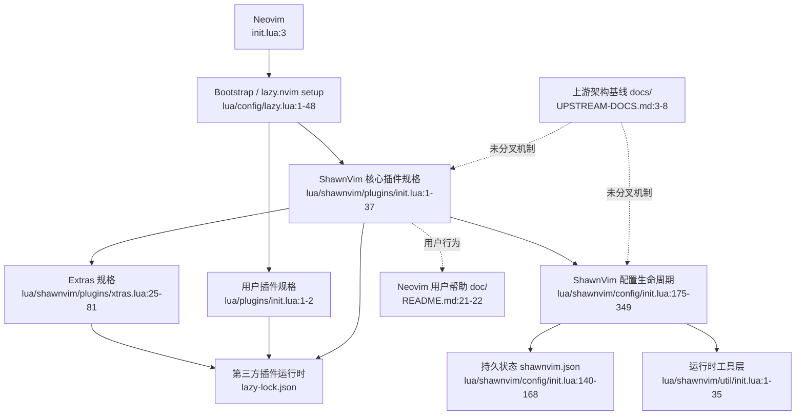

# ShawnVim 整体运行架构

## 1. 定位与受众

ShawnVim 是基于 LazyVim 16.0.0 固定源码快照进行独立维护的 Neovim 配置发行版。仓库直接包含二次开发后的默认配置、插件规格、运行时工具和用户扩展入口；运行时不会下载或加载 `LazyVim/LazyVim`（`README.md:1-3`、`init.lua:1-3`、`lua/config/lazy.lua:26-30`）。

本文面向进行 feature design、issue analyze 的维护者，以及需要快速接手 ShawnVim 配置结构的新贡献者。本文只描述当前已经落地的结构，不记录未来规划。

## 2. 架构事实来源

ShawnVim 的架构事实由当前源码和固定上游文档快照共同提供，但适用范围不同：

1. 当前仓库源码决定精确运行行为；源码与其他资料冲突时，以源码为准（`README.md:3`、`lua/config/lazy.lua:26-48`）。
2. `docs/` 是 LazyVim 固定版本的上游开发文档快照，可作为 ShawnVim 未分叉部分的架构基线；其来源固定在 `lazyvim.github.io` commit `85e5b49e5bf0a4208bd9d1600e1710f4bb6c0e9c`（`README.md:21-28`、`UPSTREAM-DOCS.md:1-8`）。
3. 上游文档中的 `LazyVim`、`:LazyExtras` 和 `lazyvim.*` 在未改变机制时分别映射为 `ShawnVim`、`:ShawnExtras` 和 `shawnvim.*`；精确名称以当前源码为准（`lua/shawnvim/config/init.lua:1-7`、`lua/shawnvim/config/init.lua:201-208`）。
4. 本地 issue、feature 与实现记录描述已经发生的 ShawnVim 演进，并覆盖对应上游快照。当前明确覆盖点包括 Neovim 0.12.4 和 blink.cmp 1.10.2；blink 上游快照仍含旧按键值和稳定版范围，不能用于判断当前 blink 精确行为（`.codestable/features/2026-07-15-upgrade-blink-cmp/upgrade-blink-cmp-implementation.md:8-27`、`docs/extras/coding/blink.md:84-118`、`lua/shawnvim/plugins/extras/coding/blink.lua:1-15`）。
5. `doc/ShawnVim.txt` 是 Neovim `:help` 面向用户的帮助入口；它与 `docs/` 同属文档呈现层，不替代内部架构地图（`README.md:21-22`、`doc/ShawnVim.txt:1-12`）。

## 3. 术语

| 术语 | 含义 | 代码或文档锚点 |
| --- | --- | --- |
| ShawnVim 核心层 | `lua/shawnvim/` 下的默认配置、核心插件规格和运行时工具集合 | `lua/shawnvim/plugins/init.lua:12-37`、`lua/shawnvim/config/init.lua:1-22` |
| 用户配置层 | 在默认配置之后加载的 options、keymaps、autocmds 和插件规格入口 | `lua/shawnvim/config/init.lua:285-306`、`docs/configuration/general.md:7-24` |
| 核心插件规格 | `shawnvim.plugins` import 下按 coding、editor、LSP、formatting、linting、treesitter、UI、util 和 colorscheme 分类的 lazy.nvim specs | `lua/config/lazy.lua:26-30`、`docs/plugins/index.md:1-17` |
| Extra | 可选的单模块插件规格，可来自 ShawnVim 或用户 namespace，并可由 `:ShawnExtras` 管理 | `lua/shawnvim/util/extras.lua:29-33`、`lua/shawnvim/plugins/xtras.lua:25-81` |
| 运行时工具层 | 挂载在全局 `ShawnVim` 表上的按需加载工具，例如 root、format、extras、json 和 plugin | `lua/shawnvim/config/init.lua:1-7`、`lua/shawnvim/util/init.lua:1-35` |
| `VeryLazy` | 核心配置完成插件解析后，用于加载按键、自动命令和运行时服务的生命周期事件 | `lua/shawnvim/config/init.lua:178-208` |
| `LazyFile` | ShawnVim 映射到文件读取、新建和写入事件的组合型 lazy.nvim 事件 | `lua/shawnvim/util/plugin.lua:11`、`lua/shawnvim/util/plugin.lua:83-89` |

## 4. 系统结构

### 4.1 启动与编排层

根入口只负责进入 `config.lazy`；`config.lazy` 在 Neovim data path 下检查并 bootstrap lazy.nvim，然后将其加入 runtime path（`init.lua:3`、`lua/config/lazy.lua:1-24`）。该机制保留了上游 starter 的 lazy.nvim bootstrap 模型（`docs/configuration/lazy.nvim.md:44-61`）。

lazy.nvim 的根规格按固定顺序导入 `shawnvim.plugins`，再导入用户 `plugins`。默认插件规格为非 lazy，但单个插件仍可通过自己的 `event`、`cmd`、`ft` 或 `lazy` 字段覆盖默认行为（`lua/config/lazy.lua:26-34`、`docs/configuration/lazy.nvim.md:61-76`）。

`shawnvim.plugins` 首先检查最低 Neovim 版本，初始化 ShawnVim 配置模块，然后把当前配置目录注册为高优先级、非延迟的本地 `ShawnVim` 插件；Snacks 在同层承担早期 UI 和通知初始化（`lua/shawnvim/plugins/init.lua:1-37`）。

### 4.2 配置生命周期层

配置模块创建全局 `ShawnVim` 工具入口，并保存自身配置对象（`lua/shawnvim/config/init.lua:1-7`）。

初始化阶段在 lazy.nvim 解析插件模块时提前加载 options、延迟通知、安装 plugin import/rename hooks，并读取 `shawnvim.json`。这样插件规格可以在解析期间读取已经建立的全局选项和持久状态（`lua/shawnvim/config/init.lua:311-349`）。

lazy.nvim 加载本地 `ShawnVim` 插件时，按模块约定调用 `ShawnVim.setup()`，再进入配置模块的 setup 生命周期（`lua/shawnvim/init.lua:5-8`、`lua/shawnvim/config/init.lua:175-265`）。

默认配置与用户覆盖采用固定次序：先加载 `shawnvim.config.{options,keymaps,autocmds}`，再加载 `config.{options,keymaps,autocmds}`，并在每个阶段发出对应的 `User` 事件（`lua/shawnvim/config/init.lua:285-306`）。这一“默认配置先于用户配置”的扩展契约继承自上游架构（`docs/configuration/general.md:7-30`）。

进入 `VeryLazy` 后，系统补齐延迟的 autocmd、keymap、clipboard、format、news 和 root 服务，并注册 `:ShawnExtras` 与 `:ShawnHealth` 命令（`lua/shawnvim/config/init.lua:178-208`）。

### 4.3 插件规格层

核心插件规格的职责分组继承上游分类，并由当前 ShawnVim 源码实现（`docs/plugins/index.md:1-17`）：

| 分类 | 当前职责 | 代码锚点 |
| --- | --- | --- |
| Coding 与 Editor | 自动配对、文本对象、Lua 开发支持、搜索替换、跳转与按键提示 | `lua/shawnvim/plugins/coding.lua:1-88`、`lua/shawnvim/plugins/editor.lua:1-100` |
| LSP | LSP 客户端、diagnostics、inlay hints、code lens 和相关依赖 | `lua/shawnvim/plugins/lsp/init.lua:1-54` |
| Formatting 与 Linting | formatter 注册和 conform.nvim 集成；按文件类型解析并触发 linter | `lua/shawnvim/plugins/formatting.lua:1-55`、`lua/shawnvim/plugins/linting.lua:1-99` |
| Treesitter | parser 安装、更新以及 highlight、indent、folds 功能 | `lua/shawnvim/plugins/treesitter.lua:1-99` |
| UI 与 Util | bufferline、statusline、terminal、scratch、session 和共享依赖 | `lua/shawnvim/plugins/ui.lua:1-99`、`lua/shawnvim/plugins/util.lua:1-58` |
| Colorscheme | 颜色方案及其插件集成 | `lua/shawnvim/plugins/colorscheme.lua:1-63` |

Extra 层将持久化选择和默认 Extra 合并，移除重复项，按优先级排序，最后把每个 Extra 转为独立 lazy.nvim import（`lua/shawnvim/plugins/xtras.lua:25-81`）。

plugin 工具会在 lazy.nvim 解析阶段过滤禁用或废弃的 Extra、处理已重命名模块，并把 Extra 约束为单模块 import，避免递归扫描整个 Extra 目录（`lua/shawnvim/util/plugin.lua:91-149`）。

用户插件规格最后从 `lua/plugins/init.lua` 导入，因此能够在 ShawnVim 核心规格之后追加或覆盖插件配置；其规格合并语义沿用 lazy.nvim 的扩展和覆盖规则（`lua/config/lazy.lua:26-30`、`lua/plugins/init.lua:1-2`、`docs/configuration/plugins.md:50-63`）。

## 5. 关键运行交互

### 5.1 启动序列

1. Neovim 加载 `init.lua`，进入 `config.lazy`（`init.lua:1-3`）。
2. 系统确认 lazy.nvim 是否存在；不存在时克隆 stable 分支，然后把它加入 runtime path（`lua/config/lazy.lua:1-24`）。
3. lazy.nvim 依次解析 ShawnVim 核心规格和用户插件规格（`lua/config/lazy.lua:26-30`）。
4. ShawnVim 核心 import 检查 Neovim 版本并执行配置初始化（`lua/shawnvim/plugins/init.lua:1-12`）。
5. 配置初始化建立全局工具对象、加载 options、安装插件 hooks，并读取持久状态（`lua/shawnvim/config/init.lua:311-349`）。
6. 本地 `ShawnVim` 插件执行 setup，应用默认配置和用户覆盖（`lua/shawnvim/init.lua:5-8`、`lua/shawnvim/config/init.lua:175-265`）。
7. `VeryLazy` 事件完成延迟配置与运行时服务注册（`lua/shawnvim/config/init.lua:184-208`）。

### 5.2 Extra 变更序列

`:ShawnExtras` 同时扫描 `shawnvim.plugins.extras` 和 `plugins.extras` 两个 namespace（`lua/shawnvim/util/extras.lua:29-33`）。

用户切换 Extra 后，选择结果写入 `ShawnVim.config.json.data.extras` 并保存到 `shawnvim.json`；界面明确要求重启 ShawnVim 才应用变化（`lua/shawnvim/util/extras.lua:167-200`）。

下次启动时，配置层读取持久状态并执行版本迁移；Extra 编排层再合并持久选择、默认 Extra 和重命名规则（`lua/shawnvim/config/init.lua:140-168`、`lua/shawnvim/util/json.lua:46-105`、`lua/shawnvim/plugins/xtras.lua:31-64`）。

### 5.3 Root 解析序列

Root 服务默认依次尝试 LSP、项目标记和当前工作目录；每种 detector 返回候选路径（`lua/shawnvim/util/root.lua:18-67`）。解析器按 detector 优先级处理候选，并优先选择更深的匹配路径（`lua/shawnvim/util/root.lua:98-127`）。最终结果按 buffer 缓存；LSP attach、文件写入、目录变化和 buffer 进入事件会清除对应缓存（`lua/shawnvim/util/root.lua:155-191`）。

### 5.4 Formatting 序列

formatter 通过统一 registry 注册并按优先级排序；解析时只激活第一个可用的 primary formatter，同时允许非 primary formatter 参与（`lua/shawnvim/util/format.lua:16-48`）。

自动格式化状态支持全局 `vim.g.autoformat` 和 buffer-local `vim.b.autoformat`，其中 buffer-local 设置优先（`lua/shawnvim/util/format.lua:83-115`）。`BufWritePre` 触发自动格式化；`:LazyFormat` 提供强制手动格式化入口（`lua/shawnvim/util/format.lua:158-177`）。

## 6. 数据、资料与状态边界

| 状态或资料 | 所在位置 | 生命周期或作用 | 代码或文档锚点 |
| --- | --- | --- | --- |
| ShawnVim 默认配置与插件规格 | 仓库 `lua/shawnvim/` | 随代码版本变化 | `lua/shawnvim/config/init.lua:9-30`、`lua/shawnvim/plugins/init.lua:14-37` |
| 用户覆盖配置 | `lua/config/`、`lua/plugins/` | 由用户通过 Git 管理 | `lua/shawnvim/config/init.lua:285-306`、`docs/configuration/general.md:7-24` |
| 上游架构基线 | `docs/` | 固定 LazyVim 文档快照；适用于未分叉机制 | `README.md:21-28`、`UPSTREAM-DOCS.md:1-8` |
| Neovim 用户帮助 | `doc/ShawnVim.txt` | 供 `:help` 使用的用户呈现层 | `README.md:21-22`、`doc/ShawnVim.txt:1-12` |
| 插件版本锁 | `lazy-lock.json` | lazy.nvim 更新时变化 | `lazy-lock.json:1-10` |
| 插件 checkout 与 lazy.nvim 本体 | Neovim data path | 位于仓库外，由 lazy.nvim 管理 | `lua/config/lazy.lua:1-24` |
| ShawnVim 用户持久状态 | config path 下的 `shawnvim.json`，或 `vim.g.shawnvim_json` 指定路径 | 跨 Neovim 进程保留 | `lua/shawnvim/config/init.lua:140-168` |
| Extra 选择 | `shawnvim.json` 的 `extras` 字段 | 修改后在下次启动生效 | `lua/shawnvim/util/extras.lua:179-199` |
| 运行时工具缓存 | Lua module/global tables、root cache、formatter registry | 随 Neovim 进程结束而释放 | `lua/shawnvim/util/init.lua:20-35`、`lua/shawnvim/util/root.lua:181-186`、`lua/shawnvim/util/format.lua:16-24` |

## 7. 外部边界

ShawnVim 源码声明最低支持 Neovim 0.11.2；当前宿主已经升级为官方 Neovim 0.12.4 Release（`lua/shawnvim/plugins/init.lua:1-10`、`.codestable/features/2026-07-15-upgrade-blink-cmp/upgrade-blink-cmp-implementation.md:8-13`）。

系统依赖 lazy.nvim 完成插件解析、安装和加载，并复用 `lazy.core.util` 作为工具层基础（`lua/config/lazy.lua:1-30`、`lua/shawnvim/util/init.lua:1-35`）。

LSP、formatter、linter、Treesitter parser 和终端工具属于进程外能力，ShawnVim 只负责配置、选择和触发；health 模块检查 Neovim、Git、ripgrep、fd、lazygit、fzf、curl 和 Treesitter 环境（`lua/shawnvim/health.lua:9-53`）。

## 8. 已知约束

- lazy.nvim import 顺序必须是 `shawnvim.plugins`、ShawnVim Extras、用户 `plugins`；运行时会主动检查并通知错误顺序（`lua/shawnvim/config/init.lua:217-246`）。
- ShawnVim 默认 options 必须在 lazy.nvim 解析插件模块期间提前加载，不能完全延迟到 `VeryLazy`（`lua/shawnvim/config/init.lua:326-332`、`docs/configuration/general.md:37-47`）。
- 默认配置必须先于用户配置加载；用户定制应放在 `lua/config/` 和 `lua/plugins/`（`lua/shawnvim/config/init.lua:285-306`、`docs/configuration/general.md:7-30`）。
- Extra UI 的启停操作只修改持久状态，不在当前进程中重新构建完整插件图，因此需要重启后生效（`lua/shawnvim/util/extras.lua:178-199`）。
- 插件规格默认 `lazy=false`，需要延迟加载的插件必须在自身规格中声明事件、命令、文件类型或 `lazy=true`（`lua/config/lazy.lua:31-34`、`docs/configuration/lazy.nvim.md:68-76`）。
- `docs/` 中的上游标识符和已被本地升级覆盖的版本细节不能直接当作当前运行值；判断精确值时必须回到当前源码、lockfile 和本地演进记录（`UPSTREAM-DOCS.md:3-8`、`lazy-lock.json:1-10`）。

## 9. 代码与资料导航

| 问题 | 首选入口 |
| --- | --- |
| Neovim 如何进入 ShawnVim？ | `init.lua:1-3`、`lua/config/lazy.lua:1-48` |
| 上游启动模型是什么？ | `docs/configuration/lazy.nvim.md:44-99` |
| ShawnVim 本地插件如何注册？ | `lua/shawnvim/plugins/init.lua:14-37` |
| 默认配置和用户配置如何覆盖？ | `lua/shawnvim/config/init.lua:285-306`、`docs/configuration/general.md:7-30` |
| 插件扩展与合并契约是什么？ | `docs/configuration/plugins.md:16-63`、`lua/config/lazy.lua:26-30` |
| 启动生命周期在哪里组织？ | `lua/shawnvim/config/init.lua:175-349` |
| Extra 如何选择和持久化？ | `lua/shawnvim/plugins/xtras.lua:25-81`、`lua/shawnvim/util/extras.lua:167-200` |
| 插件 import 如何被修正？ | `lua/shawnvim/util/plugin.lua:56-149` |
| Root 如何计算？ | `lua/shawnvim/util/root.lua:18-191` |
| Formatting 如何调度？ | `lua/shawnvim/util/format.lua:16-178` |
| 环境健康如何检查？ | `lua/shawnvim/health.lua:9-53` |

## 10. 相关文档

- `README.md`
- `UPSTREAM-DOCS.md`
- `doc/ShawnVim.txt`
- `docs/configuration/`
- `docs/plugins/`
- `docs/extras/`
- `.codestable/reference/system-overview.md`
- `.codestable/issues/2026-07-15-startup-configuration-notifications/`
- `.codestable/features/2026-07-15-upgrade-blink-cmp/`
