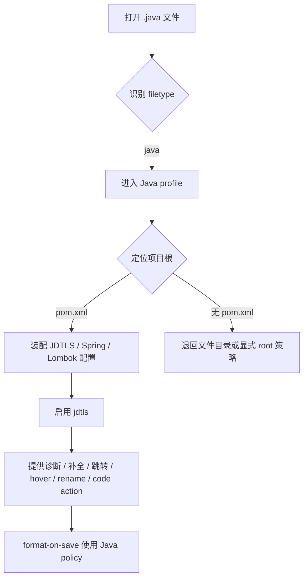

# java-lsp design

## 0. 术语约定

- **JDTLS**：Java Language Server，负责 Java 诊断、补全、跳转、重构、code action 和项目感知。
- **Maven project root**：以 `pom.xml` 为根信号的 Java 项目目录；本 feature 以 `ssc_intelli_engine` 这类 Maven 项目为目标。
- **Lombok support**：让 LSP 解析 Lombok 注解生成的成员，避免大量虚假报错与跳转失真。
- **Spring support**：让 Java LSP 能识别 Spring 项目上下文，并启用 Spring 相关增强能力。
- **JDK management**：自动提供或提示可用的 Java 运行环境，避免用户手动对齐本机 JDK。

## 1. 决策与约束

### 需求摘要

目标是：在打开 Maven Java 项目时，`jdtls` 能自动启动，并提供诊断、补全、跳转定义 / 引用、hover、rename、code action、organize imports，能识别 `pom.xml` 作为项目根，同时支持 Spring 专属增强、Lombok 解析、JDK 自动安装/可用性管理，以及 Java 格式化风格调优。

明确不做：

- 不引入 DAP 调试链路。
- 不新增 Java 测试运行器集成。
- 不把 Gradle 作为本次主目标。
- 不为非 Java 语言调整现有 LSP 规则。

### 复杂度档位

- LSP = 中等偏复杂（需要新增语言分发、服务器注册、项目根识别和工具安装策略）。
- 工具安装 = 中等（需要把 JDK、JDTLS、Spring/Lombok 相关依赖纳入自动安装或初始化检查）。
- 格式化 = 默认档位（延续现有保存时格式化策略，只为 Java 追加专门 policy）。

### 关键决策

1. Java 作为独立语言能力接入，而不是塞进现有 `frontend` 或 `python` profile。原因：Java 的项目根、工具链和格式化策略都和现有语言不同，混在一起会让名词层失真。
2. `pom.xml` 作为 Maven Java 项目的主要 root 信号；必要时可辅以 `mvnw` / `.git` 兜底，但 Maven 项目优先识别 `pom.xml`。原因：用户需求明确点名 `pom.xml` 识别。
3. Spring、Lombok、JDK 管理和格式化调优都要纳入同一 Java 工作流，而不是拆成多个 feature。原因：用户要的是“Java LSP 基础开发环境”，这些能力对该环境是同一条主链路。
4. 现有 LSP 栈继续沿用 `mason` + `mason-lspconfig` + `mason-tool-installer` + `vim.lsp.config()` / `vim.lsp.enable()` 组合，不切换整套架构。原因：仓库当前已经按这条主路径组织，新增 Java 只需扩展 registry 和 server settings。
5. JDK / Maven 自动安装采用 SDKMAN 引导脚本，不在 Neovim 启动时自动改系统环境。原因：Mason 可管理 `jdtls`、Lombok jar、`google-java-format` 和 Spring Boot tools，但不提供 JDK / Maven；SDKMAN 是用户确认后的跨 shell 工具链入口。

## 2. 名词与编排

### 2.1 名词层

#### 现状

- `lua/custom/lsp/registry.lua` 目前只注册了 `yamlls`、`lua_ls`、`basedpyright`、`ruff`、`marksman`、`vtsls`、`tailwindcss`、`biome`，没有 Java 相关服务器。
- `lua/custom/lsp/roots.lua` 已经有统一的 root helper，但 registry 里没有面向 Maven / Java 的 root 策略。
- `lua/custom/format/registry.lua` 只对 Rust、Lua、前端、Markdown、YAML 定义格式化策略，没有 Java 分支。
- `lua/custom/lang/init.lua` 只分发 Python / Frontend / Rust / Markdown，没有 Java profile。
- `lua/custom/plugins/lsp.lua` 已加载 `nvim-lspconfig`、Mason、`mason-lspconfig`、`mason-tool-installer`，具备扩展 Java 的现成入口。
- `pom.xml` 已存在，且包含 Lombok、MapStruct、Spring Boot starter test 等依赖，说明 Java 项目已经真实存在，不是空壳。

#### 变化

- 新增 Java 语言 profile，用来描述 Java filetype、LSP 服务器、格式化策略和项目约束。
- 新增 Java LSP server settings，至少覆盖 `jdtls` 的基础配置入口。
- 扩展 LSP registry，把 Maven root 识别、JDTLS 安装项和 Java 专属 server settings 纳入统一注册表。
- 扩展格式化 registry，为 Java 提供明确的格式化策略，不再依赖默认 fallback。
- 扩展语言分发，让 `.java` 文件进入 Java profile，而不是落到默认无 profile 路径。

#### 接口示例

- Java 文件打开后自动进入 Java profile：`filetype=java` → `lsp_servers` 含 `jdtls`、`formatter_policy` 含 Java 专用策略。
- Maven 项目根识别：给定 `/home/.../ssc_intelli_engine/src/main/java/...`，root helper 能回到包含 `pom.xml` 的项目根。
- 格式化策略：`filetype=java` 时返回 Java 专用 formatter 组合，而不是通用 `lsp_format=fallback`。

### 2.2 编排层

#### 主流程图

#### 现状

- 当前编排主链路由 `custom.lsp.setup()` 统一拉起：诊断策略、`LspAttach` 行为、`mason-tool-installer`、`mason-lspconfig`、`vim.lsp.config()` 和 `vim.lsp.enable()`。
- root 识别已抽成 helper，但现有 registry 只为 Python、Frontend、Rust、Markdown、YAML 提供 root 绑定。
- format registry 已按 filetype 做策略分发，适合在此层直接加 Java 分支。

#### 变化

- 在 LSP registry 中加入 Java root 检测和 `jdtls` 编排节点，使 Java 文件进入独立服务器路径。
- 在 server settings 中补 Spring/Lombok 相关初始化参数，避免把这些逻辑散落在 attach 或 plugin spec 里。
- 在 format registry 中加入 Java 格式化政策，让保存格式化和 LSP fallback 行为对 Java 明确可控。
- 在 language registry 中加入 Java profile，使 filetype → workflow 的映射一致。

#### 流程级约束

- JDTLS 只应在 Java 项目 root 可判定时启动；非 Java 文件不应触发。
- Maven root 识别失败时，必须保留退路：允许基于文件目录启动，但不能误把非 Java 项目视作 Java 项目。
- 格式化行为必须与当前保存时格式化体系兼容，不能破坏现有语言的 fallback 语义。
- Spring / Lombok 支持应默认启用在 Java profile 内，不要求用户再额外手动切换特性开关。

### 2.3 挂载点清单

- `lua/custom/lang/java.lua`：新增 Java workflow profile，集中声明 filetype、`jdtls`、formatter policy 与 Java buffer 本地选项。
- `lua/custom/lang/init.lua`：新增 `java` filetype 到 profile 的分发。
- `after/ftplugin/java.lua`：新增 Java filetype 进入 `custom.lang` profile 的入口。
- `lua/custom/lsp/registry.lua`：新增 Java server / root / mason package 注册。
- `lua/custom/lsp/server_settings/jdtls.lua`：新增 JDTLS server settings，挂载 Maven、Spring、Lombok、JDK runtime、organize imports 与 project-root metadata policy。
- `lua/custom/format/registry.lua`：新增 Java formatter policy。
- `lua/custom/plugins/treesitter.lua`：新增 Java parser 安装项。
- `lua/custom/health.lua`：新增 Java / Maven / Lombok health 检查与 SDKMAN 引导提示。
- `scripts/setup_java_sdkman.sh`：新增可选 SDKMAN 安装脚本，用于 JDK / Maven 引导安装。

### 2.4 推进策略

1. Java 名词层落位：先把 Java profile、root 识别和 server 注册口径对齐。
   - 退出信号：打开 `.java` 文件时能进入 Java profile 预期路径。
2. JDTLS 编排接入：把 `jdtls` 放进 registry 和启动链路，确保 Maven 项目能自动启用。
   - 退出信号：Maven 项目打开后能看到 `jdtls` 进程与诊断能力。
3. Spring / Lombok / JDK 策略：把增强和工具可用性纳入 Java 初始化路径。
   - 退出信号：Spring 项目上下文与 Lombok 注解不再表现为明显误报，JDK 可用性不阻塞启动。
4. Java 格式化策略：补齐 Java 保存时格式化与风格偏好。
   - 退出信号：Java 文件保存时按预期 formatter / fallback 策略执行。
5. 验收补强：针对 Maven root、核心 LSP 操作、增强能力与边界路径补证据。
   - 退出信号：验收场景可逐条观察。

### 2.5 结构健康度与微重构

#### 评估

- 文件级 — `lua/custom/lsp/registry.lua`：78 行，已承担多语言 root / 安装项注册，新增 Java 后会继续增长，但职责仍集中在“服务器注册表”。
- 文件级 — `lua/custom/format/registry.lua`：74 行，已承担跨语言格式化策略分发，继续加 Java 属于同一职责延伸。
- 文件级 — `lua/custom/lang/init.lua`：45 行，当前只是 profile 分发，新增 Java 的改动密度低。
- 目录级 — `lua/custom/lsp/server_settings/`：现有 7 个文件，目录仍可继续容纳 Java 专属 server settings。
- 目录级 — `lua/custom/lang/`：现有 5 个文件，加入 Java profile 后仍未摊平到需要拆目录的程度。

#### 结论：不做

原因：当前改动主要是给现有 registry / profile / formatter 追加一个语言分支，没有明显的职责混写、超长文件或目录摊平问题；因此本次不做微重构。

## 3. 验收契约

- 打开任意 Maven Java 项目中的 `.java` 文件 → `jdtls` 自动启动，且 `:LspInfo` / 诊断提示中能看到 Java client。
- 在 Java 文件中触发补全 / hover / 跳转定义 / 跳转引用 / rename / code action → 能得到对应 LSP 响应。
- 在含 `pom.xml` 的项目根打开 Java 文件 → root 识别应落到项目根，而不是误落到单文件目录。
- 在 Spring Java 项目中打开相关类 → 能启用 Spring 专属增强，不出现明显缺失识别。
- 在含 Lombok 注解的 Java 类中打开文件 → 注解生成成员相关的虚假报错显著减少，不影响基础导航。
- 在未手动安装 Java 工具链的机器上首次打开 Java 项目 → JDK / JDTLS 相关组件应能走自动安装/引导路径，而不是直接失败。
- 保存 Java 文件 → 应走 Java 专用格式化策略，且与现有保存时格式化行为兼容。

## 4. 与项目级架构文档的关系

- **名词**：Java profile、JDTLS、Maven root、Spring / Lombok 支持、Java formatter policy，后续应回写到 `ARCHITECTURE.md` 的 LSP / 语言工具链章节。
- **动词骨架**：`filetype -> profile -> root -> server -> capabilities -> format policy` 这条链路属于系统级可见流程，适合在架构文档中补充 Java 分支。
- **流程级约束**：`pom.xml` 优先、Java 非侵入式接入、保存格式化兼容现有 fallback 语义，这些都属于稳定约束。
- 本 feature 明显影响 `lua/custom/lsp/` 与 `lua/custom/lang/` 的系统认知，验收后应同步提炼到架构文档。
