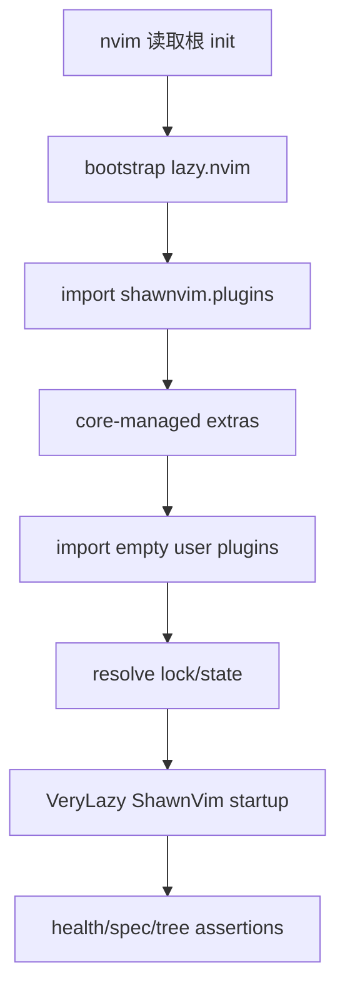

# ShawnVim Config Cutover

## 0. 术语约定

| 术语 | 定义 | 防冲突结论 |
|---|---|---|
| Config Shell | 根 `init.lua`、`lua/config/`、`lua/plugins/` 组成的最小用户 composition root | 不复制 Distribution Core 默认逻辑 |
| cutover | 真实 `~/.config/nvim` 从旧 custom runtime 切到本地 ShawnVim core | 不等同于 core import；此步会删除旧运行时 |
| empty overrides | 仅含说明、没有个人行为的 options/keymaps/autocmds/plugins 文件 | 确保初始行为来自 ShawnVim 基线 |
| clean-room start | 隔离 XDG data/state/cache 下，从当前 config tree 首次 bootstrap 并 headless 启动 | 只允许下载 lazy.nvim/声明插件，不下载 LazyVim |

## 1. 决策与约束

### 需求摘要

将真实配置入口改为 bootstrap lazy.nvim 并首先 import `shawnvim.plugins`，再 import 空白用户 `plugins`；删除旧 `lua/core`、`lua/custom`、`lua/globals.lua`、`after/ftplugin` 和旧辅助运行时，使 LazyVim-derived ShawnVim 源码完全接管。生成 `shawnvim.json` 和 tracked `lazy-lock.json`，并在隔离环境证明首次启动。

### 明确不做

- 不迁移旧主题、状态栏、LSP、Java/Python/Rust/Markdown、keymaps 或 scripts 行为。
- 不在空白 overrides 中偷偷恢复任何旧个人偏好。
- 不删除 `.codestable` 历史、legacy tag、Distribution Core、开发文档或 Git history。
- 不下载/声明 `LazyVim/LazyVim`、starter 或 upstream remote。
- 不在本 feature发布 tags、推送 origin 或建设完整 CI。

### 复杂度档位

破坏性 migration = 高：真实启动链和大量旧文件被替换，但有 legacy tag 回滚；验证必须使用隔离 stdpath，避免本机已有插件缓存掩盖问题。

### 关键决策

1. Config Shell 采用 starter-compatible bootstrap 形状，但 distribution import 改为本地 `shawnvim.plugins`，不声明远程 distribution plugin。
2. import 顺序固定：core → core-managed extras → user plugins；order checker 继续启用。
3. `lua/config/{options,keymaps,autocmds}.lua` 和 `lua/plugins/example.lua` 仅保留注释/空 spec，证明默认行为由 core 接管。
4. 旧运行时直接从工作树删除，不移动到 backup 目录；恢复统一依赖 legacy tag。
5. `lazy-lock.json` 取消 ignore 并纳入 Git；`shawnvim.json` 使用 core schema，初始 extras为空。
6. clean-room 使用真实 root入口，不通过 test-only shortcut 规避 bootstrap。
7. 任何 tree mutation 前执行 destructive preflight：core acceptance/smoke可读，legacy ref是 annotated tag且 peeled snapshot/tree可读，当前 HEAD包含该 snapshot祖先。

### 基线风险、依赖与证据

- 前置依赖：legacy snapshot/tag 和 core fork smoke 已通过。
- Top 3 风险：旧 `after/ftplugin` 仍自动加载（tree audit）、本机 lazy cache 掩盖远程 dependency（isolated XDG）、lock/state 与 core schema不一致（runtime assertions）。
- 非显然依赖：网络首次安装、git、编译工具和 Neovim >=0.11.2。
- 关键假设：用户接受旧个人行为全部消失；extras 初始为空。
- 证据：final tree diff、isolated bootstrap logs、resolved specs、lock/state files、health/headless output。
- 清洁度：不保留 `.disabled` 旧 specs、backup dirs、临时 XDG dirs、注释掉旧 init 或迁移 TODO。

## 2. 名词与编排

### 2.1 名词层

**现状**：根 `init.lua` 加载 globals/core/custom，并由 `lua/custom/plugins` 组成 plugin specs；`after/ftplugin` 继续在文件类型事件中加载旧行为；lockfile 被 ignore。

**变化**：

```lua
-- init.lua
require("config.lazy")
```

```lua
-- lua/config/lazy.lua
bootstrap("folke/lazy.nvim")
require("lazy").setup({
  spec = {
    { import = "shawnvim.plugins" },
    { import = "plugins" },
  },
})
```

状态契约：

```text
shawnvim.json
  version: 8
  install_version: 8
  news: {}
  extras: []

lazy-lock.json
  tracked: true
  source: resolved final plugin graph
```

精确删除 allowlist：`lua/core/`、`lua/custom/`（包含 ignored debug源码）、`lua/globals.lua`、`after/`、`doc/kickstart.txt`、旧 `doc/tags`、`scripts/setup_editor.sh`、`scripts/setup_java_sdkman.sh`、`test-k8s.yaml`。

明确保留：`.git/`、`.codestable/`、`lua/shawnvim/`、`queries/`、`tests/`、新 `scripts/audit-*`/`scripts/check-*`、`docs/development/`、`doc/ShawnVim.txt`、`LICENSE`、`UPSTREAM*`、NEWS/CHANGELOG、格式/静态配置。README/.github 由 release feature最终替换，不在本 feature删除。

Lock 生成契约：在隔离 data/state/cache、真实工作树 config root 下执行 lazy sync/lock，完成后 `lazy-lock.json` 是 resolved graph 中外部、可锁定 Git plugin 的 name→commit/branch/tag 投影；strict audit 使用 `git ls-files --error-unmatch` 分别验证 lock/state tracked，并比较每个外部受锁 spec 的 resolved commit。本地 `ShawnVim` self-spec 不进入 lock commit 对比，改由独立的 `name == "ShawnVim"`、`dir == stdpath("config")`、priority/lazy assertions验证；其他non-Git/local/dynamic spec也必须在JSON evidence中按理由分类，不能伪造commit。

##### Interface 设计检查

- Module：Config Shell（替换现有 composition root）。
- Interface：根 init + `config.lazy` + override directories + state/lock files。
- Seam：lazy.nvim setup spec；production和 clean-room 都从真实 init 进入。
- Depth / locality：bootstrap/import order集中在 shell，core/default behavior 不复制。
- Dependency strategy：lazy.nvim/插件为 true external Git dependencies；core 是 in-process local module。
- Adapter：无；isolated XDG 是测试环境，不改变 production interface。
- Test surface：headless start、resolved specs、runtime globals/commands/state、startup trace。

### 2.2 编排层



**现状**：旧 init 直接加载 core/custom，再 bootstrap lazy.nvim；旧 ftplugin 和 plugin specs 有多个行为入口。

**变化**：启动拓扑收敛为单一 Config Shell → local Distribution Core → empty overrides。所有旧 behavior branches 被删除，只有 Git history/tag 提供恢复。

流程级约束：

- bootstrap clone 只允许 `folke/lazy.nvim`。
- `shawnvim.plugins` 必须是第一个 distribution import；user plugins最后。
- clean-room data/state/cache 每次新建，失败保留日志但不提交临时目录。
- clean-room harness 将当前候选 tree（排除 `.git`/`.tests`/cache）复制到 `$TMP/XDG_CONFIG_HOME/nvim`，并分别设置 config/data/state/cache 四个 XDG 根；不设置 `vim.g.shawnvim_root`。先执行首次安装，再用同一临时 config执行第二次启动/health；成功清理，失败 `--keep-on-failure` 保留路径和日志到 `.tests/evidence`。`scripts/test-clean-start --real-config` 则保持真实 `~/.config/nvim` config root，只把data/state/cache指向临时目录并记录四个实际stdpath，用于无污染验证真实入口。
- bootstrap failure 使用 PATH 前置的 deterministic `git` clone stub + 空 data dir 注入；headless 必须在固定超时内非零退出并包含 `Failed to clone lazy.nvim`，不得调用 `getchar()`或触碰真实 cache/config。
- 删除旧树和生成新 lock/state 必须在同一可回滚 commit序列内，任一启动失败即阻塞。
- 可观测点：startup exit code、resolved specs、runtimepath、loaded modules、lock/state schema、health output。

### 2.3 挂载点清单

1. Neovim 入口：根 `init.lua` / `lua/config/lazy.lua` — 替换。
2. 用户 override：`lua/config/{options,keymaps,autocmds}.lua`、`lua/plugins/` — 新增空白挂载层。
3. 状态：`shawnvim.json` — 新增。
4. 插件锁：`lazy-lock.json` + `.gitignore` policy — 新增 tracked/修改。
5. 旧 runtime/aux allowlist：`lua/core`、`lua/custom`、`lua/globals.lua`、`after/`、kickstart docs、两个 setup scripts、`test-k8s.yaml` — 删除。
6. Cutover验证：`scripts/test-clean-start`、`scripts/audit-runtime-tree`、`scripts/generate-lock` — 新增。

### 2.4 推进策略

1. Destructive preflight：验证 parent feature、core smoke、annotated legacy tag/peeled tree/ancestor和删除/保留 allowlists；退出信号是任何 mutation 前全部 gate 通过。
2. Config Shell：建立 init/bootstrap/import order 和空白 overrides；退出信号是 shell 可加载且 spec graph 可解析。
3. State/lock：建立固定 schema state、取消 lock ignore，用隔离数据生成 lock；对外部可锁定Git specs核对resolved commits，对local ShawnVim self-spec核对dir/name/lifecycle；退出信号是两个文件分别严格tracked且分类后的graph一致。
4. Runtime removal：仅按精确 allowlist删除旧 runtime/aux入口；退出信号是删除集合完整、保留集合零误删、tree audit 无旧加载路径。
5. Clean-room tooling/bootstrap：交付两个 audit helpers和 lock helper，以四 XDG 根复制候选 tree并验证首次/二次启动和受控 clone失败；退出信号是 production seam、日志/清理/错误契约全通过。
6. Health/identity 收口：运行 health/spec/module/lock/tree审计；退出信号是新入口全绿、旧行为零加载。

### 2.5 结构健康度与微重构

##### 评估

- 文件级：旧 `init.lua` 将被替换而非继续扩写，不适合先微重构。
- 目录级：新 `lua/config` 4 个小入口、`lua/plugins` 1 个空 spec，不触发摊平；core 已有分层。
- 删除的旧目录职责复杂，但 legacy tag 已保留；搬文件会与“不迁移行为”冲突。
- Interface 深度：Config Shell 保持薄 composition root 是有意设计，不是 pass-through业务 module。

##### 结论：不做

## 3. 验收契约

### 3.1 关键场景

1. mutation 前 preflight → annotated legacy tag/peeled tree/ancestor、core evidence 和 allowlists 全部通过。
2. 四个空 XDG 根中的临时 `$XDG_CONFIG_HOME/nvim` 运行首次/二次 `nvim --headless` → lazy.nvim bootstrap、ShawnVim setup成功并正常退出，未设置 test root override。
3. dump specs/runtimepath → local ShawnVim core存在，不存在 LazyVim/starter。
4. 扫描 loaded modules/startup trace → 无 `core.*`、`custom.*`、旧 globals或旧 ftplugin。
5. 查看 overrides → 没有旧主题/keymaps/languages/paths，只含空白扩展点。
6. 查看 `shawnvim.json`/lock → version/install_version=8、news={}、extras=[]，两个文件严格 tracked且 lock commits对应 resolved graph。
7. deterministic clone failure → 固定超时内非零、错误文本明确、无交互且不触碰真实目录。
8. 通过 `scripts/test-clean-start --real-config` 打开真实 `~/.config/nvim` headless → config root保持真实路径，data/state/cache为临时目录，与clean-room入口一致且不使用test root override。

### 3.2 明确不做的反向核对

- tree/runtime 不应存在或加载旧 custom/core/after配置。
- bootstrap/spec 不应访问 LazyVim/starter repository。
- overrides 不应包含个人行为迁移。
- Git 不应新增 backup目录、upstream remote、release tag或远端 mutation。

### 3.3 Acceptance Coverage Matrix

| Scenario | Covered By Step | Evidence Type | Command / Action | Core? |
|---|---|---|---|---|
| destructive preflight | S1 | Git objects + command | legacy/core/allowlist assertions | yes |
| clean-room first/second start | S2/S5/S6 | command + logs | four-XDG copied config harness | yes |
| local-only distribution spec | S2/S5/S6 | command/test | spec dump | yes |
| old runtime zero load | S4/S5/S6 | command + diff review | tree/module/startup audit | yes |
| empty overrides | S2/S6 | diff review | config/plugins review | yes |
| state/lock correctness | S3/S6 | command + file | strict tracked/schema/resolved graph audit | yes |
| bootstrap failure clear | S5 | command | git clone stub + timeout | yes |
| legacy recovery intact | S1/S6 | Git object | annotated tag/ancestor verify | yes |

### 3.4 DoD Contract

| ID | 要求 | 证据 | 阻塞级别 |
|---|---|---|---|
| DOD-DESIGN-001 | cutover/deletion/bootstrap 契约通过 review | design review | blocking |
| DOD-IMPL-001 | shell/state/lock/removal steps 完成 | checklist + evidence | blocking |
| DOD-REVIEW-001 | destructive diff 与 startup quality review passed | review | blocking |
| DOD-QA-001 | clean-room/headless/health/identity 全通过 | QA logs | blocking |
| DOD-ACCEPT-001 | attention/requirements/architecture 与 roadmap 回写 | acceptance | blocking |

Validation Commands:

| ID | 命令 | 目的 | 核心性 | 失败处理 |
|---|---|---|---|---|
| CMD-001 | `scripts/test-clean-start --json .tests/evidence/cutover-start.json` | 四XDG首次/二次/失败 bootstrap | core | fix-or-block |
| CMD-002 | `scripts/audit-identity --json .tests/evidence/cutover-identity.json` | 旧 identity/repo 残留 | core | fix-or-block |
| CMD-003 | `scripts/audit-runtime-tree --json .tests/evidence/cutover-tree.json` | allowlist removal/保留和旧 module zero-load | core | fix-or-block |
| CMD-004 | `scripts/test-clean-start --real-config --json .tests/evidence/cutover-real-health.json` | 保持真实config root并隔离data/state/cache的health/startup | core | fix-or-block |
| CMD-005 | `git ls-files --error-unmatch lazy-lock.json && git ls-files --error-unmatch shawnvim.json` | 两个 state/lock 资产严格 tracked | core | fix-or-block |
| CMD-006 | `scripts/generate-lock --check-resolved --json .tests/evidence/cutover-lock.json` | schema/外部Git lock与resolved graph一致，local self-spec单独断言 | core | fix-or-block |

Required Artifacts: destructive preflight evidence、精确 deletion/preserve lists、Config Shell、empty overrides、shawnvim.json、lazy-lock、`scripts/test-clean-start`、`scripts/audit-runtime-tree`、`scripts/generate-lock`、logs/audits、review/QA/acceptance。

## 4. 与项目级架构文档的关系

acceptance 必须把真实启动链、Config Shell、import order、state/lock policy 和旧 runtime removal 回写 attention/requirements/architecture；这是架构现状正式切换点。
