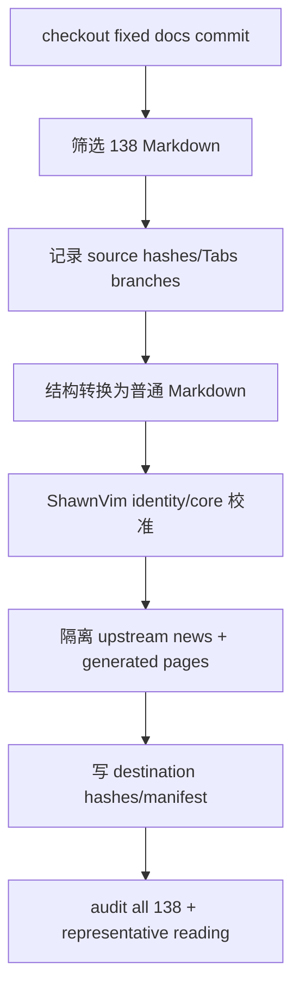

# ShawnVim Development Docs

## 0. 术语约定

| 术语 | 定义 | 防冲突结论 |
|---|---|---|
| docs snapshot | 官方 docs repo commit `85e5b49e...` 中选定的 138 个 Markdown | 不读取动态 HEAD，不含 category YAML |
| working docs | `docs/development/0.1.0/` 下适配 ShawnVim 后的普通 Markdown | 不依赖 Docusaurus runtime |
| source file | 上游 138 个 Markdown 之一，在 `SOURCE.json.source_files` 唯一映射 | 与 ShawnVim 新增 generated file 分离 |
| upstream history | 原 `docs/news.md`，保真保存为 `upstream/lazyvim-news.md` | 不机械改牌为 ShawnVim 历史 |
| Tabs branch bijection | 每个源 TabItem 与目标 heading section 的顺序/label/body evidence 一一对应 | 无 MDX 残留不代表此契约自动成立 |

## 1. 决策与约束

### 需求摘要

项目 owner 已确认持有转载权。本 feature 只接收固定官方快照中的 138 个 Markdown，不复制 3 个 `_category_.yml`、图片、静态资源或站点工程；把 configuration/plugins/extras/keymaps 等内容适配到 ShawnVim 0.1.0，并用逐文件双 hash、结构映射和全树 audit 证明完整性与可读性。

### 明确不做

- 不复制任何非 Markdown 上游文件，包括 `_category_.yml`、logo、package/yarn/Docusaurus/React 配置、scripts、workflows、static/src。
- 不建设或部署文档网站。
- 不把转载/适配文档声明为根 Apache-2.0；其权利边界由 `UPSTREAM-DOCS.md` 管理。
- 不把 LazyVim news/history 改名为 ShawnVim 历史。
- 不在文档中承诺 core 不具备的 extras、commands 或兼容 alias。

### 复杂度档位

内容迁移 = 高：138 个 Markdown 含大量 MDX/Tabs/admonition 和动态代码事实，需要结构化解析、双快照校准和机器/人工双证据。输出本身为静态文档，无站点运行时。

### 关键决策

1. 目标路径按版本冻结为 `docs/development/0.1.0/`；未来版本新增目录，不静默改写 0.1.0。
2. `SOURCE.json.source_files` 恰好 138 条，保存 source/destination 双 hash；新增 ShawnVim 页面进入 `generated_files`，三份 YAML只进入 `excluded_upstream_files`。
3. MDX 结构转换为普通 Markdown：Tabs → 带 label 的 sections；admonition → 带粗体类型的 blockquote；ESM/JSX 全部清除。
4. Tabs 完整性使用 branch ordinal/label/body hash bijection；不能仅依赖 residual scan。
5. docs commit 与 core commit 分别记录；plugin/extras/generated-style 文档以 `lua/shawnvim` 为最终事实，校准动作写入 transform。
6. 原 upstream news 原文隔离；working `news.md` 只索引 ShawnVim NEWS/CHANGELOG 和上游历史入口。

### 基线风险、依赖与证据

- 前置依赖：`shawnvim-core-fork` design contract；实现时必须等 core 文件可读。
- Top 3 风险：Tabs 分支丢失（bijection gate）、代码链接/命令漂移（core path audit）、权限/许可证误述（UPSTREAM-DOCS + README scope）。
- 非显然依赖：官方 docs commit 比 source final commit 早；不能假设页面与 core 同次构建。
- 关键假设：138 个 Markdown 是用户要求的完整范围；category YAML/导航顺序不需要保留。
- 证据：Git fixed commit、SOURCE dual hashes、parser audit JSON、identity/link/path checks、代表性人工阅读。
- 清洁度：不提交临时 clone/build、Docusaurus残留、空转换页面、TODO/FIXME、broken local link。

## 2. 名词与编排

### 2.1 名词层

**现状**：仓库没有版本化开发文档；官方 docs repository 的 Markdown 混合普通 Markdown 与 MDX/Docusaurus constructs，且使用 LazyVim names/repo paths。

**变化**：

```text
DocsSnapshotManifest
  source_repository
  source_commit
  source_markdown_files = 138
  source_filter
  calibrated_core_commit
  calibrated_core_manifest_sha256
  calibrated_core_tree_sha256
  redistribution_basis
  source_files[138]
  generated_files[]
  excluded_upstream_files[3]
  site_assets_imported = []
```

每个 `source_files`：

```text
source, destination
source_sha256, destination_sha256
transform.operations[]
  kind = move-verbatim|strip-esm-import|tabs-to-sections|admonition-to-blockquote|asset-to-text|identity-rewrite|link-rewrite|core-reconcile
  input_sha256 + output_sha256
  selector + parameters + reason
tab_groups[]
  group_ordinal + group_context
  source_branches[]      = branch_ordinal, label, body_sha256
  destination_branches[] = branch_ordinal, heading, body_sha256
```

Docs audit interface：

```text
scripts/audit-docs
  --source-cache .tests/upstream/lazyvim-docs
  --fetch-missing
  --docs docs/development/0.1.0
  --manifest docs/development/0.1.0/SOURCE.json
  --core .
  --json .tests/evidence/docs.json
```

cache 缺失时只能 fetch manifest 固定 commit `85e5b49e...`，不得读取动态 HEAD或给项目增加 remote；`.tests/upstream` 与 `.tests/evidence` 均 ignored。网络/fetch失败返回非零并保留日志，成功后 cache 可复用。audit 要求 `calibrated_core_commit` 是当前HEAD祖先、当前 `UPSTREAM-SOURCE.json` hash等于 `calibrated_core_manifest_sha256`，并对文档技术事实路径 `lua/shawnvim/` 与 `doc/ShawnVim.txt` 计算稳定tree digest等于 `calibrated_core_tree_sha256`；NEWS/CHANGELOG只校验入口存在，不进入内容digest，允许后续独立发布历史增长。不要求当前HEAD等于core feature commit。

##### Interface 设计检查

- Module：Documentation Baseline（新增）。
- Interface：版本目录 + SOURCE manifest + audit CLI。
- Seam：逐文件 manifest 是 source/working seam，`lua/shawnvim` 是文档事实 seam。
- Depth / locality：provenance、MDX转换、identity/link/core校准集中在 docs module；release 只运行 audit。
- Dependency strategy：一次性 external Git snapshot，运行时无外部依赖。
- Adapter：无站点 adapter；audit 直接读静态文件。
- Test surface：manifest bijection、MDX residual、Tabs groups/branches、普通 Markdown links/anchors、assets、core code paths。

### 2.2 编排层



**现状**：官方页面依赖 Docusaurus renderer，路径/命令指向 LazyVim，navigation metadata由非 Markdown YAML 提供。

**变化**：编排成为一次性 deterministic snapshot transform。YAML 导航不参与，目录层级保留；所有工作页面脱离 site runtime。转换证据与目标内容同 commit。

流程级约束：

- 固定 commit、138 count 和 `.md` suffix fail-closed；动态 HEAD 或数量变化不自动接受。
- Parser 忽略 fenced/inline code 后识别结构语法，防止把示例代码误改。
- 固定 snapshot 的 125 个 Tabs 文件、487 个 groups、975 个 branches 必须按 `group_ordinal + parent heading context + branch_ordinal` 唯一映射；source/target group/branch 数量、顺序、规范化 label 必须一致。
- Structural transform 先只移除 wrappers/转换 headings；规范化 source branch body 与 structural intermediate body hash 必须相等，证明内容未在结构转换阶段丢失。
- Identity/link/core calibration 必须由 `transform.operations` 的受控、可重放操作表达；每个operation按顺序消费前一步完整文档`input_sha256`并产生`output_sha256`，selector限定到结构节点、精确literal、link或带precondition hash的block，parameters只包含该枚举所需参数和reason。禁止source-mapped文件使用无前置条件的whole-file literal replacement；`core-reconcile`必须记录旧block hash、目标block hash、core证据路径与理由。audit从固定source重放后必须与destination hash完全相等。
- Body hash 规范化为 LF、移除 wrapper/首尾空行、保留内部空白；目标 branch 正文非空。
- Docusaurus root-relative/extensionless routes 必须转换为 destination-relative `.md` links；fragment 使用GitHub `github-slugger`兼容语义校验，audit内置固定fixtures覆盖Unicode/emoji、标点、大小写和重复heading suffix，并用同一算法计算目标anchor；external HTTP(S) links保持外部。
- 任何本地 link/image/core path 不存在时失败；不导入 `/img/logo.svg`，intro 改为纯文字。
- `docs/news.md` 唯一映射到 `upstream/lazyvim-news.md`，必须使用单个`move-verbatim` operation并满足source/destination bytes及SHA-256完全相等；只有generated working `news.md`允许写ShawnVim内容。
- audit 输出包含覆盖计数与失败文件，不允许只打印“passed”。

### 2.3 挂载点清单

1. 开发文档入口：`docs/development/0.1.0/` — 新增。
2. Provenance：`docs/development/0.1.0/SOURCE.json` — 新增。
3. 文档权利边界：`UPSTREAM-DOCS.md` 与 README license section — 新增/修改。
4. 文档验证入口：`scripts/audit-docs` — 新增。
5. 上游历史入口：`docs/development/0.1.0/upstream/lazyvim-news.md` — 新增保真副本。

### 2.4 推进策略

1. Snapshot inventory：固定 commit、筛选 138 Markdown、记录排除项与 source hashes；退出信号是 source_files/excluded counts 精确。
2. Structural transform：转换 imports/JSX/Tabs/admonition/asset refs；退出信号是 residual gate 通过且 Tabs bijection 完整。
3. ShawnVim calibration：改 namespace/commands/repo links/version/core paths；退出信号是 identity/code-path audit 通过。
4. History/provenance：以byte-identical `move-verbatim`隔离upstream news，新增working index、UPSTREAM-DOCS、README license section、core commit/manifest/tree digest和destination hashes；退出信号是专门provenance与README双入口都明确转载文档不受根Apache自动覆盖，来源/权利/历史边界可审计。
5. 文档验证：从固定 commit cache运行 full audit 和代表性阅读；退出信号是 138 source→138 destination + 1 generated Markdown gate 全绿且抽查分支语义正确。

### 2.5 结构健康度与微重构

##### 评估

- 文件级：138 个上游页面以内容适配为主，不对单页做职责拆分，否则破坏 source mapping。
- 目录级：保留上游 configuration/plugins/extras 分层，避免 138 文件摊平；不复制 category YAML。
- `scripts/` 当前规模小，新增一个 audit CLI 不触发目录重组。
- Interface 深度：manifest/audit 提供小接口隐藏大批量转换复杂度。

##### 结论：不做

超出范围的观察：未来文档站需要导航/renderer 时另开 feature，不在当前静态文档中预埋 Docusaurus。

## 3. 验收契约

### 3.1 关键场景

1. 读取 fixed snapshot → 精确选出 138 个 `.md`，三份 category YAML 仅列为 excluded 且无 destination。
2. 核对 SOURCE manifest → 138个source唯一映射、source/destination双hash正确，1个generated working news单列，目标Markdown总数139；upstream news source/destination bytes相等。
3. 扫描 working docs → code-aware residual gate 下无 ESM/JSX/Tabs/TabItem/admonition/站点 asset。
4. 核对含 Tabs 页面 → 125 files / 487 groups / 975 branches 的 group context、顺序、label 一致；wrapper-only structural body hash相等，calibration operations 可重放到 final hash。
5. 校验 links/assets/core paths → 所有Docusaurus routes已变为相对`.md` link，fragment按固定GitHub slugger fixtures/算法命中本地目标，代码链接指向`lua/shawnvim`，core commit为当前祖先且manifest/tree digest不漂移。
6. 扫描 identity → provenance/upstream news 之外无旧 namespace/commands/repo install instructions。
7. 阅读 installation/configuration/keymaps/plugins/extras → 普通 Markdown 可读、分支语义与 core一致。
8. 查看 license/provenance → 文档不被根 Apache 自动覆盖，转载权/版权/再使用边界明确。

### 3.2 明确不做的反向核对

- destination 不应存在 `_category_.yml`、package/yarn/Docusaurus/React/src/static/workflow 文件或 logo。
- working docs 不应依赖站点 renderer。
- ShawnVim news 不应声称拥有 LazyVim 13-16 历史。
- audit 不应读取动态 docs HEAD。

### 3.3 Acceptance Coverage Matrix

| Scenario | Covered By Step | Evidence Type | Command / Action | Core? |
|---|---|---|---|---|
| 138 source + 1 generated Markdown完整映射 | S1/S4 | manifest + command | audit inventory/dual hashes/total=139 | yes |
| 无 MDX/Docusaurus 残留 | S2/S5 | command | code-aware audit | yes |
| Tabs groups/branches 全保留 | S2/S5 | manifest + command | 125/487/975 structural/calibration replay | yes |
| ShawnVim identity/core 一致 | S3/S5 | command + diff review | identity/link/path audit | yes |
| history/rights 边界 | S4/S5 | diff review | upstream news、UPSTREAM-DOCS、README license section | yes |
| upstream news byte-identical | S4/S5 | manifest + command | move-verbatim + equal SHA/bytes | yes |
| representative semantics | S5 | manual review | 五类页面抽查 | yes |
| 非 Markdown 未复制 | S1/S5 | command | excluded/destination scan | yes |

### 3.4 DoD Contract

| ID | 要求 | 证据 | 阻塞级别 |
|---|---|---|---|
| DOD-DESIGN-001 | Markdown-only/provenance/transform 契约通过 review | design review | blocking |
| DOD-IMPL-001 | 138 source mappings 和转换全部完成 | checklist + manifest | blocking |
| DOD-REVIEW-001 | 文档 diff/工具质量 review passed | review report | blocking |
| DOD-QA-001 | full audit + representative reading 通过 | audit JSON + QA | blocking |
| DOD-ACCEPT-001 | 文档入口/权利/roadmap 状态回写 | acceptance | blocking |

Validation Commands:

| ID | 命令 | 目的 | 核心性 | 失败处理 |
|---|---|---|---|---|
| CMD-001 | `scripts/audit-docs --source-cache .tests/upstream/lazyvim-docs --fetch-missing --docs docs/development/0.1.0 --manifest docs/development/0.1.0/SOURCE.json --core . --json .tests/evidence/docs.json` | fixed-source inventory/MDX/Tabs/replay/link/path 全量审计 | core | fix-or-block |
| CMD-002 | `scripts/audit-identity --json .tests/evidence/docs-identity.json` | 全仓库旧身份 allowlist | core | fix-or-block |
| CMD-003 | `git diff --check` | 文档/manifest whitespace | supporting | fix-or-block |

Required Artifacts: 138 source-mapped + 1 generated Markdown（目标总数139）、SOURCE.json（受限operation schema、core commit/manifest/tree digest）、UPSTREAM-DOCS.md、README license section、byte-identical upstream news、audit CLI/ignored cache+JSON（含slugger fixtures结果）、manual reading/rights-boundary evidence、review/QA/acceptance。

## 4. 与项目级架构文档的关系

acceptance 应记录 Documentation Baseline 的版本冻结、provenance manifest、rights boundary 和 no-site-runtime 约束；不改变 Neovim runtime 架构，但构成项目维护/发布架构。
