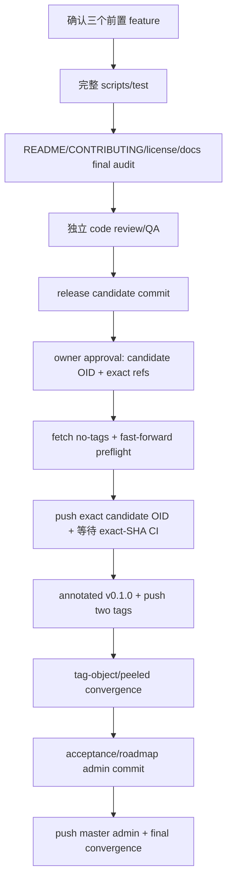

# ShawnVim Release Hardening

## 0. 术语约定

| 术语 | 定义 | 防冲突结论 |
|---|---|---|
| release gate | 本地完整验证、独立 review/QA、CI matrix 与远端对象核对的组合 | 任一核心项失败都不能标记发布完成 |
| clean-room | 不复用本机 data/state/cache 的真实 Config Shell 启动环境 | 与 core minit smoke 分工不同 |
| identity audit | 对 tracked paths/content/resolved specs 的旧 LazyVim 身份 allowlist 检查 | provenance/history 例外必须精确路径化 |
| release candidate commit | code/config/docs/tests 与 acceptance-ready metadata 完成、本地 review/QA通过的 immutable commit；`v0.1.0` 最终指向它 | CI 必须验证该精确 SHA |
| post-release admin commit | tag/push/CI远端证据产生后，回写 acceptance/roadmap/approval history 的管理提交 | `master` 可领先 `v0.1.0`，但不得改变 release payload；其OID从Git对象推导，不写入自身内容 |
| remote convergence | origin/master 等于 admin commit；两个 annotated tags 的 tag-object/peeled OID分别与本地一致 | 部分 push 不算完成 |

## 1. 决策与约束

### 需求摘要

为最终 ShawnVim tree 建立单一本地测试入口、独立 GitHub CI（Neovim v0.11.2 + stable）、clean-room/identity/source/docs/license checks、README/CONTRIBUTING；归档旧 roadmap，在验证通过后创建 annotated `v0.1.0`，并把 `master`、legacy tag、release tag 同步到现有 origin。

### 明确不做

- 不使用 LazyVim/folke 仓库专属 reusable workflow、starter 或上游 CI secrets。
- 不创建 GitHub Release、发布 package 或额外分支。
- 不改变已批准 core/docs/cutover公开契约；发现偏差回对应 feature 修复。
- 不 force push、不覆盖远端 tag、不在 origin 发生 divergence 时自行改写历史。
- 不把文档转载子树错误标记为 Apache-2.0。

### 复杂度档位

发布/外部副作用 = 高：涉及 CI、网络、branch/tag protection 和公开远端；必须先本地全绿，再进行可重试、可核对的非强制同步。

### 关键决策

1. `scripts/test` 是本地与 CI 共用的总入口，调用 core、clean-room、source/docs/identity/license audits，避免两套验证路径；`--json-evidence` 只能原子写入 ignored `.tests/evidence/`。
2. CI workflow 在 repo 内自包含，job id固定为`test`，`name: test (${{ matrix.neovim }})`，matrix key固定为`neovim: [v0.11.2, stable]`；删除旧 `.github/workflows/stylua.yml`，新 `ci.yml` 是唯一 gate。workflow 使用 `ubuntu-latest`、顶层 `permissions: contents: read`、push `master`/pull_request/workflow_dispatch triggers、每 job 30 分钟 timeout、无 cache clean run；Neovim setup action以实现时审计的full commit SHA固定，安装git/curl/make/gcc/ripgrep/unzip并调用同一`scripts/test`。workflow audit必须验证job id/name/matrix键和值，避免CI查询依赖未声明字符串。
3. README 只提供 ShawnVim 安装/入口/开发文档；CONTRIBUTING 说明 core/overrides/docs边界和本地验证。
4. 先创建 release candidate commit，再 `git fetch origin --prune --no-tags` 并证明 `origin/master` 是 candidate 的祖先；随后按精确 candidate OID 非强制 push `master` 触发 CI。只有该精确 SHA 的 v0.11.2/stable jobs 都通过，才创建同 SHA 的 annotated `v0.1.0`。
5. Tags 按 ref单独推送；annotated tag同时比较 tag-object OID和 peeled commit OID。远端同名tag缺失或双 OID已相同才允许继续，冲突阻塞。
6. CI/tags/remote证据产生后写 acceptance与roadmap completion，形成 post-release admin commit，再非强制 push master；最终 origin/master=由`git rev-parse HEAD`推导的admin OID、tags仍指向 candidate/legacy snapshots。tracked PublishEvidence不得保存包含自身的admin OID。
7. `scripts/audit-license` 是 core gate：验证 LICENSE、UPSTREAM.md、UPSTREAM-DOCS.md、README 边界文本，确保 docs子树不被根 Apache自动覆盖，并核对 provenance identity allowlist。
8. 首次candidate push前必须写/更新本feature的`approval-report.md`，展示candidate OID、origin URL、将更新的branch/tag refs、非force约束、CI/tag/admin两阶段和“不创建GitHub Release”，并取得owner明确批准；该报告在candidate之后生成，随post-release admin commit归档。缺少批准时停在remote mutation前。

### 基线风险、依赖与证据

- 前置依赖：core fork、development docs、config cutover 全部通过 acceptance-ready状态。
- Top 3 风险：最低版本 plugin incompatibility（matrix）、远端部分 push/protection（preflight + object reconciliation）、identity/docs/license 漏洞（统一 scripts/test）。
- 非显然依赖：GitHub credentials、tag/branch permission、网络、Actions 可用性；GitHub REST 查询使用 `curl`/`jq`，可选 `GITHUB_TOKEN` 只用于提高 rate limit，不能写入仓库；OCR/reviewer provider不属于发布运行时。
- 关键假设：现有 origin/master 是目标，用户授权正常非 force commit/tag push；CI 可运行。
- 基线风险：当前 origin 落后本地 6+ commits，push 前必须 fetch确认未产生 divergence。
- 证据：ignored `.tests/evidence/release-local.json`、independent review/QA、candidate SHA 的 CI run/jobs/status URL、acceptance中的 PublishEvidence、`git ls-remote` tag-object/peeled OIDs、GitHub Release API 404。
- 清洁度：不提交 CI logs、temp XDG、node/plugin caches、debug output、TODO/FIXME、注释掉 workflow。

## 2. 名词与编排

### 2.1 名词层

**现状**：当前 repo 只有旧 Stylua workflow，无 ShawnVim full test/CI/release contract；本地 commits 未同步，尚无 legacy/v0.1.0 remote tags。

**变化**：

```text
LocalTestEvidence (writer: scripts/test, ignored .tests/evidence)
  local_test: passed
  audits:
    identity/source/docs/license/runtime_tree: passed

PublishEvidence (writer: acceptance, tracked post-release admin commit)
  candidate_oid
  code_review: passed
  qa: passed
  nvim_matrix: { v0.11.2: passed, stable: passed }
  ci_run_id + ci_url + exact_head_sha
  local_and_remote:
    candidate_branch_oid
    legacy_tag_object_oid + legacy_peeled_oid
    release_tag_object_oid + release_peeled_oid
  github_release: absent

FinalConvergenceEvidence (writer: release orchestrator after admin push, ignored .tests/evidence/release-final.json)
  admin_oid (derived from git rev-parse HEAD)
  remote_branch_oid
  candidate_is_ancestor: true
  admin_diff_scope: .codestable-only
  final legacy/release tag object + peeled OIDs
```

Test interface：

```text
scripts/test [--json-evidence <path>]
  atomically writes LocalTestEvidence and exits 0 only when local core gates pass
  failure: nonzero; no stale "passed" evidence
```

Git publish contract：

```text
origin/master == local post-release admin commit
remote refs/tags/<tag> == local tag-object oid
remote refs/tags/<tag>^{} == local peeled commit oid
v0.1.0^{} == release candidate commit
release candidate is ancestor of post-release admin commit
git diff candidate..admin contains only .codestable/ paths
force_update = false
github_release = none
```

##### Interface 设计检查

- Module：Verification & Release（新增）。
- Interface：`scripts/test`、CI workflow、release evidence、Git refs。
- Seam：同一 test CLI 被 local/CI 调用；Git refs 是发布/恢复 seam。
- Depth / locality：所有验证编排集中，具体 core/docs checks由已有 audit CLIs 承担。
- Dependency strategy：GitHub/Actions/origin 是 true external；本地 tests提供替代诊断但不伪造 remote结果。
- Adapter：local runner + CI runner 是同一 CLI 的两个真实环境，不创建 mock CI。
- Test surface：matrix runs、audit JSON、remote object comparison。

### 2.2 编排层



**现状**：验证与同步是零散手工动作，旧 workflow 只检查格式；没有发布状态机。

**变化**：引入两阶段提交的 release state machine。candidate包含实际 release payload并先推 master触发 CI；CI验证该 SHA后 tag；远端事实再回写 post-release admin commit，最终 master可领先tag但不改payload。

流程级约束：

- tests 失败先修对应 feature，不修改验收标准绕过。
- CI matrix 任一失败阻塞；允许记录第三方短暂故障并重试，不允许静默跳过 v0.11.2。
- Tag 名冲突 fail-closed；已正确对象幂等接受。
- remote divergence 阻塞并报告，不 merge/rebase/force替用户决策。
- candidate push前先完成`approval-report.md` owner gate，再重新fetch，要求`origin/master`是candidate祖先；push后再次fetch并要求`origin/master == candidate`。任一批准/ancestry/equality断言失败都阻塞，不自动merge/rebase。
- CI查询必须以`head_sha == candidate`选择push event run，再读取该run的jobs；workflow固定job id/name/matrix key，使机器gate可精确要求`test (v0.11.2)`和`test (stable)`。只看最新master run、workflow badge或聚合结论不算证据。等价的`gh run list --workflow ci.yml --commit "$CANDIDATE_OID"`/`gh run view`仅作为人工查询入口，机器gate使用GitHub REST +`curl`/`jq`，避免要求本机全局安装`gh`。
- `v0.1.0` 只指 candidate；acceptance/旧 roadmap completion在 post-release admin commit，admin只允许 CodeStable/publish evidence变化。
- LocalTestEvidence原子写入ignored `.tests/evidence`；PublishEvidence由acceptance写入tracked报告，不原地补写candidate文件，也不嵌入admin/final branch OID。admin push后的FinalConvergenceEvidence原子写入ignored `.tests/evidence/release-final.json`，由最终交接摘要引用，避免为回填自身OID再制造第三个commit。
- 两个 annotated tags 的远端核对必须同时查询 `refs/tags/<tag>` 与 `refs/tags/<tag>^{}`，分别比较 tag-object 与 peeled OID；不能只比较 peeled target。
- post-release admin push前再次fetch，要求`origin/master == candidate`且candidate是admin祖先；push后再次fetch，要求`origin/master == ADMIN_OID`，并验证`candidate..admin`只修改`.codestable/`。`ADMIN_OID`在admin commit创建后由`git rev-parse HEAD`设置并写入ignored/local command evidence，不回填到该commit中的tracked PublishEvidence。
- GitHub Release 不存在的机器证据是 `GET /repos/ShawnZhongChn/nvim.dot/releases/tags/v0.1.0` 返回 404；`gh api` 的等价人工检查不能把非零退出误判为网络失败。
- 可观测点：local JSON、review/QA reports、exact-SHA CI run/job URL/status、pre/post branch/tag-object/peeled refs、GitHub Release API 404。

### 2.3 挂载点清单

1. 本地验证入口：`scripts/test` 及 audit/test helpers — 新增/整合。
2. GitHub CI：`.github/workflows/ci.yml` — 替换为独立 matrix。
3. 对外文档：`README.md`、`CONTRIBUTING.md`、license/provenance sections — 替换/新增。
4. Git refs：annotated `v0.1.0`、远端 legacy tag、`origin/master` — 新增/更新。
5. CodeStable 状态：旧 roadmap completed、ShawnVim acceptance/release evidence — 更新。

### 2.4 推进策略

1. Test/CI orchestration：整合 `scripts/test`、本地 evidence、self-contained matrix workflow、license audit并删除旧 Stylua workflow；退出信号是本地全量 gates通过且 CI契约可审。
2. Release payload/docs：完成 README、CONTRIBUTING、license/provenance 与 release-ready metadata；退出信号是公开 payload 与最终 tree 一致且 license audit通过。
3. Candidate freeze：对完整候选 tree执行独立 code review/QA与本地全量 gate，解决 findings 后创建 immutable candidate commit；退出信号是 reports/evidence对应同一 candidate tree且 working tree无 payload 漂移。
4. Candidate publish/CI：生成带candidate OID/refs的approval report并取得owner批准；fetch no-tags、验证fast-forward、按精确OID非强制push candidate到master，push后再次fetch，再按`head_sha`等待matrix；退出信号是approval approved、远端master等于candidate且固定名称的v0.11.2/stable jobs都通过。
5. Tags publish：创建同 candidate SHA的 annotated `v0.1.0`，逐 ref push release/legacy tags并核对 object+peeled OIDs；退出信号是两个tags收敛、tag message正确且GitHub Release API为404。
6. Admin closure：写acceptance/PublishEvidence与approval history，完成ShawnVim与旧modernization roadmaps，创建只改`.codestable/`的admin commit；从HEAD推导`ADMIN_OID`，push前后都fetch并非强制push；退出信号是origin/master=ADMIN_OID，candidate是其祖先，tracked evidence无self-OID，tags仍指向candidate/legacy snapshots。

### 2.5 结构健康度与微重构

##### 评估

- 文件级：`scripts/test` 是编排入口，应只调用专责 audit helpers，不堆叠解析逻辑；新建而非扩写旧 setup scripts。
- 目录级：`scripts/` 将含多个 `audit-*` / `test-*` 文件，命名已按职责分组；数量预计未触发 ≥8 且新增≥2 后的明显摊平风险，若实际超阈值实现阶段应建立 `scripts/checks/` 纯移动结构。
- Workflow 单文件只承载 matrix和统一入口，不混入实现逻辑。
- Interface 深度：test CLI 隐藏多 gate orchestration，CI 只是 caller。

##### 结论：不做

条件观察：若实现时 `scripts/` 同层达到目录摊平阈值，先做只移动不改行为的 `scripts/checks/` 微重构并独立验证。

## 3. 验收契约

### 3.1 关键场景

1. 本地运行 `scripts/test` → core/docs/cutover/source/license/identity gates 全通过，并原子写入 ignored `.tests/evidence/release-local.json`。
2. candidate 非强制 push 后按 `head_sha == candidate_oid` 读取 push event run → v0.11.2/stable 两个 matrix job 均通过，run/job URL可追溯。
3. README clone/start/commands → 与真实 repo、ShawnVim commands、0.1.0 docs入口一致。
4. license audit → 根 Apache 范围与转载 docs rights边界无冲突。
5. 创建 `v0.1.0` → annotated tag peeled target等于 candidate，message包含两个 upstream commits和 no GitHub Release。
6. push 前发现 origin divergence/tag-object或peeled冲突 → 阻塞且不 force/update tag；fetch后 ancestry/equality assertions可证伪。
7. 正常同步 → candidate先成为remote master并通过CI；admin closure后remote master等于admin，candidate是其祖先，两个tag的remote object/peeled OIDs分别与本地一致。
8. 部分 push失败 → 已成功refs不移动，本地对象保留，可按缺失ref幂等重试；同名错误对象仍阻塞。
9. 查询 `releases/tags/v0.1.0` → HTTP 404，证明本次没有GitHub Release。
10. 比较 `candidate..admin` → 只包含 `.codestable/` acceptance、approval、roadmap与状态证据，不改变code/config/docs/tests payload；admin push后ignored FinalConvergenceEvidence记录derived admin/remote OID。

### 3.2 明确不做的反向核对

- workflow 不应引用上游 reusable CI、LazyVim repo/starter或外部 secrets继承。
- GitHub 不应出现本次创建的 Release。
- git history/refs不应包含 force update或远端 tag覆盖。
- README/license不应把转载文档自动标为 Apache-2.0。
- release diff不应恢复旧个人 runtime。

### 3.3 Acceptance Coverage Matrix

| Scenario | Covered By Step | Evidence Type | Command / Action | Core? |
|---|---|---|---|---|
| local full gate | S1/S3 | command + JSON | `scripts/test` | yes |
| self-contained CI contract | S1/S3 | diff review + command | workflow audit | yes |
| concrete publish approval | S4 | approval report | candidate OID、exact refs、non-force/no-Release scope | yes |
| public docs/license correct | S2/S3 | diff review + audit | README/license/docs checks | yes |
| immutable candidate payload | S3/S6 | Git object + diff | candidate OID、`candidate..admin` allowlist | yes |
| exact-SHA v0.11.2 + stable | S4 | REST status + jobs | `head_sha` run query + jobs query | yes |
| annotated v0.1.0 | S5 | Git objects | `cat-file`/local object+peeled compare | yes |
| non-force conflict behavior | S4/S5/S6 | command/manual | fetch、ancestry、equality、tag conflict preflight | yes |
| branch/tag remote convergence | S5/S6 | remote OIDs | `ls-remote` exact refs + final branch equality | yes |
| GitHub Release absent | S5 | HTTP status | release-by-tag API returns 404 | yes |
| partial push retry | S5/S6 | command evidence | per-ref reconciliation | no |

### 3.4 DoD Contract

| ID | 要求 | 证据 | 阻塞级别 |
|---|---|---|---|
| DOD-DESIGN-001 | release/CI/Git contract 通过 review | design review | blocking |
| DOD-IMPL-001 | test/CI/docs/candidate/admin steps完成 | checklist/evidence | blocking |
| DOD-REVIEW-001 | 独立 code review passed | review report | blocking |
| DOD-QA-001 | local gates、candidate exact-SHA CI matrix与publish preflight通过 | QA/evidence | blocking |
| DOD-ACCEPT-001 | remote branch/tag objects一致、GitHub Release缺失且roadmaps回写 | tracked PublishEvidence + ignored FinalConvergenceEvidence | blocking |

Validation Commands:

| ID | 命令 | 目的 | 核心性 | 失败处理 |
|---|---|---|---|---|
| CMD-001 | `scripts/test --json-evidence .tests/evidence/release-local.json` | 本地全量 gate与原子 ignored evidence | core | fix-or-block |
| CMD-002 | `scripts/audit-license --json .tests/evidence/release-license.json` | Apache源码与转载docs权利边界 | core | fix-or-block |
| CMD-003 | `git diff --check` | tree cleanliness | core | fix-or-block |
| CMD-004 | `git fetch origin --prune --no-tags` | branch remote-tracking preflight，不让冲突tag污染本地ref | core | fix-or-block |
| CMD-005 | `git merge-base --is-ancestor origin/master "$CANDIDATE_OID"` | candidate push前证明是非强制fast-forward | core | fix-or-block |
| CMD-006 | `git fetch origin --prune --no-tags && test "$(git rev-parse origin/master)" = "$CANDIDATE_OID"` | candidate push后刷新remote-tracking并证明远端branch精确指向候选 | core | fix-or-block |
| CMD-007 | `curl -fsSL "https://api.github.com/repos/ShawnZhongChn/nvim.dot/actions/workflows/ci.yml/runs?head_sha=$CANDIDATE_OID&event=push&per_page=20" > .tests/evidence/release-runs.json && RUN_ID="$(jq -er --arg sha "$CANDIDATE_OID" '(.workflow_runs \| map(select(.head_sha == $sha and .event == "push"))) as $runs \| if (($runs \| length) == 1 and $runs[0].status == "completed" and $runs[0].conclusion == "success") then ($runs[0].id \| tostring) else error("exact-SHA run not uniquely successful") end' .tests/evidence/release-runs.json)" && printf '%s\n' "$RUN_ID" > .tests/evidence/release-run-id.txt` | 选择唯一exact-SHA成功run并持久化RUN_ID | core | retry-or-block |
| CMD-008 | `RUN_ID="$(cat .tests/evidence/release-run-id.txt)" && curl -fsSL "https://api.github.com/repos/ShawnZhongChn/nvim.dot/actions/runs/$RUN_ID/jobs?per_page=100" \| jq -e '[.jobs[] \| select(.name == "test (v0.11.2)" or .name == "test (stable)") \| .conclusion] \| length == 2 and all(. == "success")'` | 从同一run-id证据核对两个明确matrix jobs | core | retry-or-block |
| CMD-009 | `test "$(git cat-file -t refs/tags/legacy-nvim-config-2026-07-14)" = tag && test "$(git cat-file -t refs/tags/v0.1.0)" = tag && test "$(git rev-parse 'refs/tags/v0.1.0^{}')" = "$CANDIDATE_OID" && git for-each-ref --format='%(contents)' refs/tags/v0.1.0 \| rg -F '459a4c3b1059671e766a46c7cc223827dc67e3d0' && git for-each-ref --format='%(contents)' refs/tags/v0.1.0 \| rg -F '85e5b49e5bf0a4208bd9d1600e1710f4bb6c0e9c' && git for-each-ref --format='%(contents)' refs/tags/v0.1.0 \| rg -F 'No GitHub Release'` | 本地两个annotated tags、release target与tag provenance message | core | fix-or-block |
| CMD-010 | `test "$(git ls-remote origin 'refs/tags/legacy-nvim-config-2026-07-14' \| cut -f1)" = "$(git rev-parse refs/tags/legacy-nvim-config-2026-07-14)" && test "$(git ls-remote origin 'refs/tags/legacy-nvim-config-2026-07-14^{}' \| cut -f1)" = "$(git rev-parse 'refs/tags/legacy-nvim-config-2026-07-14^{}')" && test "$(git ls-remote origin 'refs/tags/v0.1.0' \| cut -f1)" = "$(git rev-parse refs/tags/v0.1.0)" && test "$(git ls-remote origin 'refs/tags/v0.1.0^{}' \| cut -f1)" = "$(git rev-parse 'refs/tags/v0.1.0^{}')"` | 远端两个tag-object与peeled OID逐项收敛 | core | fix-or-block |
| CMD-011 | `test "$(curl -sS -o /dev/null -w '%{http_code}' https://api.github.com/repos/ShawnZhongChn/nvim.dot/releases/tags/v0.1.0)" = 404` | 证明没有GitHub Release | core | retry-or-block |
| CMD-012 | `ADMIN_OID="$(git rev-parse HEAD)" && git fetch origin --prune --no-tags && test "$(git rev-parse origin/master)" = "$ADMIN_OID" && git merge-base --is-ancestor "$CANDIDATE_OID" "$ADMIN_OID" && test -z "$(git diff --name-only "$CANDIDATE_OID..$ADMIN_OID" \| rg -v '^\.codestable/')"` | 从Git对象推导admin OID，最终branch收敛且admin只含管理证据 | core | fix-or-block |

Required Artifacts: `scripts/test`、ignored LocalTestEvidence、`scripts/audit-license`、固定job id/name/matrix契约的`.github/workflows/ci.yml`与exact-SHA run/job URLs、README/CONTRIBUTING、license/provenance audit、candidate/admin commits、approved `approval-report.md`、两个annotated tags、remote branch/tag-object/peeled OID proof、GitHub Release 404、review/QA/acceptance PublishEvidence（不含admin/final branch OID）与ignored `.tests/evidence/release-final.json`。

## 4. 与项目级架构文档的关系

acceptance 需要完成 architecture/requirements/attention 的最终现状同步，记录 release verification/CI、version/tag policy、documentation baseline 与 Git sync contract；随后把旧 modernization roadmap 标记 completed。
