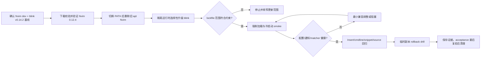

# Neovim 0.12.4 与 blink.cmp v1.10.2 升级设计

## 0. 术语约定

- **目标版本**：blink.cmp 官方稳定版 `v1.10.2`，peeled commit 固定为 `78336bc89ee5365633bcf754d93df01678b5c08f`，不跟踪分支 HEAD。
- **宿主版本**：Neovim 官方稳定版 `v0.12.4`；当前 `/usr/bin/nvim` 的 apt `0.12.0-dev` 包在新 binary 验证后删除，不保留并行可用版本。安装完成后只保留一个 canonical `nvim` 实体；旧的 `~/.local/opt/nvim-*` 目录在 S1 验证通过后删除。
- **选择性升级**：只允许更新 blink.cmp 及被其兼容性强制要求的直接配套依赖，不执行全量插件升级。
- **隔离运行时**：执行 worktree 使用独立的 XDG data/state/cache，避免升级测试改写日常 Neovim 的插件安装目录和日志。
- **行为基线**：当前 `v0.14.2` 下已通过的启动、Insert 补全、cmdline 补全、snippet 与 source 组合。

## 1. 决策与约束

### 需求摘要

先将当前 apt unstable 提供的 Neovim `0.12.0-dev` 切换到官方稳定 `v0.12.4`，再将锁定的 blink.cmp `v0.14.2` 升级到官方稳定版 `v1.10.2`。成功标准是新 Neovim binary 为 Release 构建、旧 apt 包已删除，目标 blink 版本被 lockfile 精确记录，现有 ShawnVim 配置无需语义降级即可加载，启动和核心补全路径无新增错误。

明确不做：

- 不跟踪 blink.cmp 分支 HEAD，不启用本地 Rust build 模式。lockfile 中现有 `branch: main` 只是仓库默认分支元数据，目标版本仍由 tag/commit 固定。
- 不全量更新其他 Neovim 插件；非必要 lockfile 变化必须排除。
- 不借升级重设计补全按键、source 顺序、snippet 策略或 UI。
- 不改回刚修复的 `<Left>/<Right> = {}`；该写法同时兼容 v0.14.2 与 v1.10.2。
- 不在本 feature 内安装 Neovim 0.11.2；最低版本实机覆盖若环境不可用，必须作为 residual risk 明确记录。
- 不保留 `/usr/bin/nvim` 的旧 apt dev 包与 `~/.local/opt` 中的第二个历史版本；切换并验收成功后删除旧目录、旧包和临时 tarball，只保留 PATH 中的一个 `nvim`。旧版本删除后不承诺回到 apt dev 版本；若目标 binary 后续损坏，回退边界是用已验证的官方 tarball 重新安装同一 `v0.12.4`。

### 复杂度档位

采用 Standard lane。除了补全引擎跨越约 594 个上游提交，还涉及宿主运行时替换和 Neovim 0.12 breaking-change smoke；必须经过独立设计审查、实现审查与验收。

### 关键决策

1. **固定升级到 v1.10.2**：插件 spec 将稳定版本声明从 `version = "*"` 改为 `version = "1.10.2"`，并使用稳定 tag 与 peeled commit `78336bc89ee5365633bcf754d93df01678b5c08f`，不用分支 HEAD，保证结果可复现。
2. **先隔离、后更新**：execution worktree 固定为 `/home/shawn/.config/nvim-worktrees/blink-cmp-upgrade/nvim`；目标运行时设置 `XDG_CONFIG_HOME` 为 worktree 父目录，data/state/cache 分别放 `${TMPDIR:-/tmp}/shawnvim-blink-cmp-upgrade/target/{data,state,cache}`。rollback drill 另用 `${TMPDIR:-/tmp}/shawnvim-blink-cmp-upgrade/rollback-config/nvim` 与 `rollback/{data,state,cache}`，不得复用 target data。implement 负责创建，acceptance 保存必要输出后负责清理，仓库内不得出现运行缓存。
3. **lockfile 范围守护**：基于 feature 分支与 `master` 的 merge-base 做 JSON 键级比较，唯一允许变化的 key 是 `blink.cmp`，且新 commit 必须精确等于目标 peeled commit。若直接配套依赖确实必须同步，停止实现并回到用户/design-review scope checkpoint，不由实现者自行扩大范围。
4. **兼容优先而非追新配置**：当前最新版 LazyVim blink 配置与 ShawnVim 结构一致；默认保留现有配置，只对 v1.10.2 可复现失败做最小兼容调整。
5. **可回退**：升级失败时不合并；恢复目标 lock 条目并重新同步即可回到 v0.14.2，不保留半迁移状态。
6. **matcher 不静默降级**：v1.10.2 的预编译 Rust matcher/health 必须正常；Lua fallback 默认视为未满足升级质量目标，只有 owner 明确接受后才能降为 residual risk。
7. **单版本收敛**：固定验证官方 release API `https://api.github.com/repos/neovim/neovim/releases/tags/v0.12.4` 及 asset `https://github.com/neovim/neovim/releases/download/v0.12.4/nvim-linux-x86_64.tar.gz` 的 SHA256 `012bf3fcac5ade43914df3f174668bf64d05e049a4f032a388c027b1ebd78628`、架构、Release 版本和 `vim.version()` 后，原子安装到不带版本号的 `~/.local/opt/nvim` 并链接 `~/.local/bin/nvim`。确认 symlink realpath、PATH 和完整冷启动均使用新 binary 后，执行 `sudo apt remove neovim`；最后删除旧 `~/.local/opt/nvim-*` 历史目录和下载物，不改 apt 源、不保留旧包。

### 执行风险与证据计划

主要风险：

1. 配置 schema 或自定义 setup hook 在新版本失配。缓解：先强制加载插件并检查 Notifications，再进入交互验证。
2. 插件能加载但补全行为或 matcher backend 发生静默回归。缓解：分别验证 Insert 默认 sources、接受/fallback、`:`、`/`、`?`、snippet、Lua lazydev source 与 checkhealth，而不只看进程退出码。
3. 升级污染日常插件目录或顺带更新其他依赖。缓解：隔离 XDG 运行时 + lockfile 文件级范围检查。
4. 宿主 binary 切换失败导致无法启动编辑器。缓解：先验证 tarball binary 与配置冷启动，再改 PATH 并删除 apt 包；失败时保留 tarball临时副本直到 acceptance 完成。

非显然依赖：可访问 GitHub release/prebuilt binary；sudo 权限用于删除旧 apt 包；design/checklist/design-review 必须先提交到 `master`，再创建 basename 为 `nvim` 的 linked worktree，使 unit 与隔离 `XDG_CONFIG_HOME` 都可读。

关键假设：官方最新版 LazyVim 配置可作为兼容性参照，但 ShawnVim 必须用自己的运行时验证自证；目标版本不依赖“仍为最新”这一时间性假设。

交付物：唯一 Neovim 0.12.4 user-local binary；更新后的 `lazy-lock.json`；如验证强制要求则包含最小 blink 配置兼容改动；记录 host binary、base/target commit、XDG 路径、逐场景结果与 rollback drill 的 implementation evidence；实现审查与验收证据。

清洁度规则：不保留临时 XDG 数据、调试输出、TODO/FIXME、注释掉的旧配置或无关 lockfile 变化。

## 2. 名词与编排

### 2.1 名词层

**现状**：`lazy-lock.json` 将 `blink.cmp` 固定在 commit `485c034…`（v0.14.2）；`lua/shawnvim/plugins/extras/coding/blink.lua` 通过 `version = "*"` 声明稳定版范围，并使用 blink.cmp 的公开 config schema。

**变化**：lockfile 中的 blink.cmp 解析结果升级为 v1.10.2 的 peeled commit `78336bc89ee5365633bcf754d93df01678b5c08f`。配置契约原则上不变；只有新版本对当前配置产生可复现校验或运行错误时，才加入最小兼容改动。

接口示例：

```text
输入：在隔离运行时选择性更新 blink.cmp
输出：lazy-lock.json 的 blink.cmp commit 对应 v1.10.2，其他非必要插件条目不变

错误：新版本加载或核心交互失败
结果：feature 阻塞，不合并，不以关闭检查或删除现有行为绕过
```

本 feature 不新增公共 module interface、seam 或 adapter。

### 2.2 编排层



**现状**：日常 Neovim 使用 `/usr/bin/nvim` 的 apt `0.12.0-dev`；共享 data/state/cache 由 lockfile 控制已安装插件版本，blink 在 `InsertEnter` 或 `CmdlineEnter` 时加载。

**变化**：先验证 user-local 官方 Neovim 0.12.4 并切换 PATH，确认完整 ShawnVim 冷启动后立即删除旧 apt 包，再在 linked worktree 的隔离 XDG 环境完成 blink 版本解析和安装；按 smoke → matcher/source health → 交互回归 → disposable config rollback drill → 独立审查顺序推进。apt 删除前的 Nvim 切换失败仍可回到旧 PATH；apt 删除后不回装历史 dev 包，blink 失败只回退插件 lock。任一核心场景失败都停止合并；不允许用全量更新掩盖单插件依赖问题。

流程级约束：升级必须可重复；失败不修改 `master`；验证日志不得混入日常 Neovim 状态；版本升级与其他插件升级保持顺序隔离；target 与 rollback 的 config/data/state/cache 必须完全分离，并分别断言实际 checkout HEAD。

### 2.3 挂载点清单

- `lazy-lock.json` 的 `blink.cmp` 条目 — 修改现有版本挂载点。
- `lua/shawnvim/plugins/extras/coding/blink.lua` 的稳定版声明 — 保持现有挂载方式，只有兼容失败时才做最小调整。

本 feature 不新增挂载点。卸载本次升级时，恢复旧 lock 条目并同步插件即可回到 v0.14.2。

### 2.4 推进策略

1. 宿主升级：下载并验证官方 `nvim-linux-x86_64.tar.gz`、SHA256、架构与 Release 元数据；user-local binary 冷启动成功后原子链接 PATH，精确断言 `vim.version().major/minor/patch == 0/12/4` 且 `vim.version().prerelease == nil`，再删除旧 apt 包及旧安装目录。
2. 基线隔离：建立 basename 为 `nvim` 的 linked worktree 与明确的 XDG data/state/cache，确认新 Neovim + blink v0.14.2 冷启动基线可复现。
3. 版本解析：将 `lua/shawnvim/plugins/extras/coding/blink.lua` 的稳定声明 pin 到 `1.10.2`，只更新 blink.cmp，以 merge-base JSON 比较确认唯一 lock key 与精确目标 commit。
4. 配置兼容：强制加载 v1.10.2；无失败则保持配置零 diff，有失败才做一处一证据的最小调整。
5. 自动 smoke：用新 `$NVIM_BIN` 的主动 assert/xpcall + `cquit` 核对导入、加载、关键 config 与相关 Notifications，保证失败产生非零退出码。
6. backend/source health：正向断言 `require("blink.cmp.fuzzy").implementation_type == "rust"`、实际 checkout HEAD、checkhealth library success；默认 sources 用候选证据而非仅注册证据，lazydev 可额外记录 provider 注册。
7. 交互回归：按 I1-I7 逐项验证 LSP/path/buffer/snippet 候选、接受/fallback、`: / ?` cmdline 左右键与 lazydev；LSP fixture 使用 `/home/shawn/.local/share/nvim/mason/bin/lua-language-server`，缺失则阻塞而非跳过。
8. 回退与交接：在独立 rollback config/data/state/cache 中用旧 lock 同步并强制加载 v0.14.2，分别断言 rollback checkout `485c034…` 与 target checkout `78336bc…`；确认旧 apt 包已删除并保存 manifest。implementation 只保留 target/rollback 运行时供后续 review/acceptance 复验；清理临时 XDG 与 tarball 属于 acceptance 最后一项，不属于本步骤。

### 2.5 结构健康度与微重构

#### 评估

- 文件级 — `lua/shawnvim/plugins/extras/coding/blink.lua`：212 行，职责集中于 blink.cmp spec、兼容 source 与集成配置；预计零到一处兼容调整，不存在三处以上独立改动。
- 文件级 — `lazy-lock.json`：机器生成锁文件，不适用职责拆分。
- 文件级 — `/usr/bin/nvim` 与 `~/.local/bin/nvim`：宿主安装产物，不进入仓库 diff；通过版本/路径命令验证。
- 目录级 — `lua/shawnvim/plugins/extras/coding/` 当前 8 个同层文件；本 feature 不新增源码文件，不加剧目录摊平。验证逻辑使用命令与 workflow evidence，不新增一次性脚本目录。
- compound 未发现目录、命名或归属约束。

#### 结论：不做

本次不做微重构或目录调整，避免依赖升级与结构变化混在同一 diff。

## 3. 验收契约

### 3.1 关键场景

1. Neovim 宿主版本 → 官方 asset/checksum/架构验证通过；`~/.local/bin/nvim --version` 为 v0.12.4 Release，symlink realpath 指向唯一目标，canonical PATH 中无第二个真实版本，旧 `/usr/bin/nvim` apt 包已删除。
2. 选择性升级 → `lazy-lock.json` 唯一变化 key 为 `blink.cmp`，commit 精确等于 `78336bc89ee5365633bcf754d93df01678b5c08f`。
3. 全新隔离 Neovim 冷启动并强制加载 ShawnVim 与 blink.cmp → 主动断言精确宿主版本、`stdpath()` 四路径、lazy import、关键插件初始化和 blink 加载成功；Notifications/messages 中无 error、blink、config、schema 或 import-order 错误，失败时退出码非零。
4. matcher health → v1.10.2 使用可用的预编译 Rust matcher，checkhealth 无 backend error 或 Lua fallback 警告。
5. Insert 默认 sources → 以可区分输入分别观察 LSP、path、snippets、buffer 候选；接受与 fallback 按键保持现有语义。
6. cmdline 行为 → 在 `:`、`/`、`?` 分别观察对应候选，`<Left>/<Right>` 保持原生光标移动而不选择补全项。
7. Lua lazydev → Lua buffer 中 lazydev provider 注册并产生可识别候选，不出现 provider error。
8. snippet 路径 → 展开一个已知 snippet，并观察 `<Tab>` snippet-forward/fallback 行为。
9. rollback drill → disposable config 副本恢复旧 lock 后同步并强制加载 v0.14.2；目标 worktree 仍保持 v1.10.2，旧 Nvim apt 包不恢复。
10. 网络、binary 或配置验证失败 → feature 阻塞且不合并，不留下无关插件升级或临时运行数据。

交互证据编号：

- **I1 LSP**：使用绝对路径 lua-language-server fixture，在 Lua buffer 输入 `vim.api.nvim_`，观察 LSP 候选。
- **I2 path**：在 `lua/` 下的 Lua 字符串中输入 `./lua/sha` 或 `/home/shawn/.config/nvim/lua/sha`，观察 path 候选。
- **I3 buffer**：预置唯一词 `BlinkUpgradeBufferFixture`，在另一行输入其前缀，观察 buffer 候选。
- **I4 snippets**：在 Lua buffer 输入当前锁定 friendly-snippets `lua/lua.json` 中的 `lf=`（local-function）trigger，观察 snippets 候选并完成展开；若 fixture 不存在，记录缺失并阻塞，不改用模糊 trigger。
- **I5 accept/fallback**：分别验证有候选时 `<C-y>` 接受候选，以及在普通文本 `zz` 无候选时 `<C-y>`/`<Tab>` 保留原键语义且不吞输入。
- **I6 cmdline**：在 `:`、`/`、`?` 中分别输入可产生候选的前缀；每类先记录光标列，再按 `<Left>/<Right>`，确认光标列变化而选中项不被接受。
- **I7 lazydev**：LuaLS 已附着的 Lua buffer 输入 `local x = require("sn")`，把光标放在 `sn` 后并观察 lazydev 提供的 `snacks` module 候选且无 provider error。

### 3.2 明确不做的反向核对

- diff 不应把 blink.cmp 切到 `main` 或启用 Rust 本地 build。
- diff 不应包含与 blink.cmp 无关的插件 lock 条目变化。
- diff 不应重设计现有按键、sources、snippet 或 UI。
- 仓库不应出现隔离 XDG 的缓存、下载物或临时日志。

### 3.3 Acceptance Coverage Matrix

| Scenario | Covered By Step | Evidence Type | Command / Action | Core? |
|---|---|---|---|---|
| 目标版本与 lock 范围 | S3 | JSON assertion | merge-base 与当前 lock JSON 键级比较 | yes |
| 冷启动与强制加载 | S5 | command output | `$NVIM_BIN` 隔离 XDG 下 assert/xpcall load + stdpath、关键初始化与广义 Notifications/messages 查询 | yes |
| Neovim stable runtime | S1 | version + command output | 官方 asset/checksum provenance/架构、临时 binary 完整冷启动、realpath、user-local `nvim --version`、精确版本/Release/prerelease 断言、apt package absence | yes |
| matcher backend | S6 | health output | `checkhealth blink.cmp` 与 backend 断言 | yes |
| Insert 默认 sources | S6 | runtime interaction | LSP/path/snippets/buffer 可区分输入逐项观察 | yes |
| cmdline 与左右键 | S7 | runtime interaction | `:`、`/`、`?` 逐项操作 | yes |
| lazydev 与 snippet | S6-S7 | runtime interaction | Lua buffer provider + 已知 snippet 展开 | yes |
| rollback drill | S8 | command output | disposable config 旧 lock 同步与 v0.14.2 强制加载 | yes |
| 失败与清洁度 | Acceptance DoD | diff/status review | Nvim 单版本、lock 范围、XDG/旧目录/tarball 最终 absence、git status | yes |

### 3.4 DoD Contract

| ID | 要求 | 证据 | 阻塞级别 |
|---|---|---|---|
| DOD-DESIGN-001 | design 与 checklist 完整并通过独立 design review | design review | blocking |
| DOD-RUNTIME-001 | Neovim 0.12.4 Release binary 已安装且旧 apt dev 包已删除 | version/path/package evidence | blocking |
| DOD-IMPL-001 | checklist steps 完成且 v1.10.2 安装/运行证据落盘 | checklist + command output | blocking |
| DOD-REVIEW-001 | code review passed 且无 unresolved blocking | review report | blocking |
| DOD-QA-001 | Standard lane 的 accept-inline verification matrix 覆盖核心命令与交互场景 | acceptance inline evidence | blocking |
| DOD-ACCEPT-001 | acceptance 核对核心场景、范围与回退性，并在最后复验后清理 target/rollback XDG 与 tarball，主动断言清理完成 | acceptance report + absence assertions | blocking |

Validation Commands:

| ID | 命令 | 目的 | 核心性 | 失败处理 |
|---|---|---|---|---|
| CMD-001 | `git diff --check` | diff 基础完整性 | core | fix-or-block |
| CMD-000 | `bash -lc 'set -euo pipefail; asset=/tmp/nvim-linux-x86_64.tar.gz; echo "012bf3fcac5ade43914df3f174668bf64d05e049a4f032a388c027b1ebd78628  $asset" | sha256sum -c -; listing=$(tar -tzf "$asset"); printf "%s\\n" "$listing" | grep -Fx "nvim-linux-x86_64/bin/nvim" >/dev/null; test "$(uname -m)" = x86_64; test -x "$HOME/.local/bin/nvim"; test "$(readlink -f "$HOME/.local/bin/nvim")" = "$HOME/.local/opt/nvim/bin/nvim"; test -z "$(find "$HOME/.local/opt" -maxdepth 1 -mindepth 1 -type d -name "nvim-*" -print -quit)"; export PATH="$HOME/.local/bin:$PATH"; test "$(command -v nvim)" = "$HOME/.local/bin/nvim"; paths=$(type -a -p nvim | xargs -r readlink -f | sort -u); test "$(printf "%s\\n" "$paths" | sed "/^$/d" | wc -l)" = 1; "$HOME/.local/bin/nvim" --headless "+lua local v=vim.version(); assert(v.major==0 and v.minor==12 and v.patch==4); assert(v.prerelease==nil)" +qa; ! dpkg-query -W -f=\${Status} neovim 2>/dev/null | rg -q "install ok installed"'` | 官方 asset、SHA256、架构、精确 Release、symlink realpath、PATH 唯一真实 binary、历史版本目录为空、apt 包删除与单版本收敛 | core | fix-or-block |
| CMD-002 | `bash -lc 'set -euo pipefail; test "$(basename "$PWD")" = nvim; export NVIM_BIN="${HOME}/.local/bin/nvim" XDG_CONFIG_HOME="$(dirname "$PWD")" XDG_DATA_HOME="${TMPDIR:-/tmp}/shawnvim-blink-cmp-upgrade/target/data" XDG_STATE_HOME="${TMPDIR:-/tmp}/shawnvim-blink-cmp-upgrade/target/state" XDG_CACHE_HOME="${TMPDIR:-/tmp}/shawnvim-blink-cmp-upgrade/target/cache"; test "$("$NVIM_BIN" --headless --clean "+lua print(vim.fn.stdpath([[config]]),vim.fn.stdpath([[data]]),vim.fn.stdpath([[state]]),vim.fn.stdpath([[cache]]))" +qa 2>/dev/null)" = "$(printf "%s/nvim %s/nvim %s/nvim %s/nvim" "$XDG_CONFIG_HOME" "$XDG_DATA_HOME" "$XDG_STATE_HOME" "$XDG_CACHE_HOME")"; test "$(git -C "$XDG_DATA_HOME/nvim/lazy/blink.cmp" rev-parse HEAD)" = 78336bc89ee5365633bcf754d93df01678b5c08f; "$NVIM_BIN" --headless "+lua vim.defer_fn(function() local ok,err=xpcall(function() local v=vim.version(); assert(v.major==0 and v.minor==12 and v.patch==4 and v.prerelease==nil); assert(type(ShawnVim)==[[table]]); assert(require([[lazy]])); assert(require([[blink.cmp]])); assert(vim.wait(15000,function() return require([[blink.cmp.fuzzy]]).implementation_type==[[rust]] end,100),[[rust matcher not active]]); local h=Snacks.notifier.get_history(); local m=vim.fn.execute([[messages]]); local bad=vim.tbl_filter(function(n) local nm=tostring(n.msg):lower(); return n.level==vim.log.levels.ERROR or nm:find([[blink]]) or nm:find([[schema]]) or nm:find([[import]]) or nm:find([[config]]) end,h); local ml=m:lower(); assert(#bad==0,vim.inspect(bad)); assert(not ml:match([[e%d+]]),m); assert(not ml:match([[blink]]) and not ml:match([[schema]]) and not ml:match([[import]]) and not ml:match([[config]]),m) end,debug.traceback); if not ok then io.stderr:write(err..[[\n]]); vim.cmd([[cquit 1]]) else vim.cmd([[qa]]) end end,1500)"'` | 实际 checkout、精确宿主版本、四个 stdpath、完整配置初始化、Rust matcher、广义 Notifications/messages 与非零失败 | core | fix-or-block |
| CMD-003 | `python3 -c 'import json,subprocess; b=subprocess.check_output(["git","merge-base","master","HEAD"],text=True).strip(); old=json.loads(subprocess.check_output(["git","show",f"{b}:lazy-lock.json"],text=True)); new=json.load(open("lazy-lock.json")); changed={k for k in old.keys()|new.keys() if old.get(k)!=new.get(k)}; assert changed=={"blink.cmp"},changed; assert new["blink.cmp"]["commit"]=="78336bc89ee5365633bcf754d93df01678b5c08f",new["blink.cmp"]; spec=open("lua/shawnvim/plugins/extras/coding/blink.lua").read(); assert "version = not vim.g.shawnvim_blink_main and \"1.10.2\"" in spec'` | JSON 级 lock 范围、精确目标与 stable spec pin | core | fix-or-block |
| CMD-004 | 在 target 隔离 XDG 先显式加载 blink.cmp，再运行 `checkhealth blink.cmp`；从 `filetype=checkhealth` 的特殊 buffer 主动读取 lines 并用 `writefile()` 保存（不对 `buftype=nofile` 直接 `:write`）；断言输出非空，正向匹配 `Your system is supported by pre-built binaries` 与 `blink_cmp_fuzzy lib is downloaded/built`，同时否定 backend error/Lua fallback/failed | matcher/backend 健康 | core | fix-or-block |
| CMD-005 | 在删除 apt 包前用已验证的 `$HOME/.local/bin/nvim` 对日常 ShawnVim 配置执行完整 headless 冷启动；只读复用既有插件 data，隔离临时 state/cache，禁止 sync/install；主动断言精确 `0.12.4` Release、`require("lazy")`、`ShawnVim` 初始化和广义 Notifications/messages 无 error/import/config 错误，失败用 `cquit 1` | 删除旧宿主前的配置安全门禁 | core | fix-or-block |

Required Artifacts: design-review、implementation evidence（含 XDG/版本/场景/rollback manifest）、code-review、acceptance inline verification matrix 与 acceptance report。

## 4. 与项目级架构文档的关系

本 feature 只更新内部补全引擎版本，不引入系统级名词、跨模块流程或不可逆架构决策；acceptance 核实后无需新增 CONTEXT 或 ADR。
