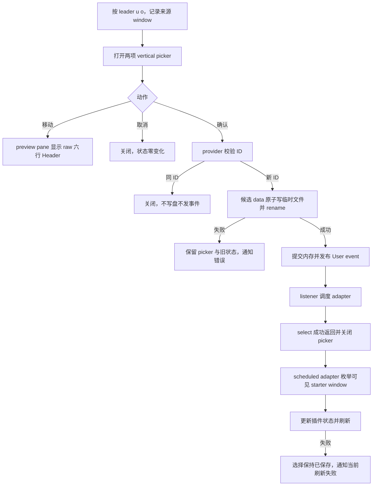

# Dashboard 霓虹 Logo 选择器设计

## 0. 术语约定

| 术语 | 定义 | 防冲突结论 |
|---|---|---|
| Logo 成品（Logo preset） | 一份不可再拆选的完整六行 Header，包含稳定 ID、展示名、文案、字符集、霓虹艺术字和右侧装饰 | `preset` 在本设计中特指 ShawnVim Logo registry 条目，不等同于 `Snacks.dashboard.preset` |
| Logo provider | 保存两款成品并解析、选择当前有效成品的共享内部模块 | 不沿用各 starter 的硬编码 `header`；caller 不直接读写 JSON 或 registry |
| Logo picker | 由 `<leader>uo` 打开的两项 Snacks picker，列表展示成品名，preview pane 展示完整 raw Header | 不新增 Dashboard 页面按钮，也不复用 `<leader>uC` |
| Starter adapter | 让一个 starter 重新读取 provider 输出并刷新当前可见页面的适配契约 | 统一的是“可见 Header 与 provider 当前值一致”的结果，不是假设第三方插件共用 redraw API |

## 1. 决策与约束

### 1.1 需求摘要

把当前带 `Z/z` 装饰的 LazyVim 风格 Header 替换为 “Shaw N vim” 霓虹艺术字，并在 `<leader>u` UI 分组中提供类似 Colorscheme 的选择体验。用户一次选择完整成品；聚焦候选即可预览，确认后持久化并刷新当前可见 Dashboard，下次启动继续使用。

用户已否决极客终端和安静极简，只保留两款霓虹成品：

1. `Shaw N vim` + Unicode `✦`；
2. `SHAW N VIM` + Nerd Font Neovim glyph ``（U+E6AE）。

成功标准：picker 恰好提供这两款已确认成品；选择/取消/无效值/保存失败行为可预测；四类已有 starter 使用同一 provider；Dashboard 按钮、按钮快捷键、顺序、动作和布局配置保持不变。

明确不做：

- 不提供极客终端、安静极简或其他风格；不补足六款候选。
- 不提供文案、字符集、风格的独立选择器，也不做随机、计时或循环轮换。
- 不在 Dashboard 按钮区加入入口，不修改按钮或布局。
- 不覆盖 `<leader>uL` 或其他已有 `<leader>u` 映射；只新增 `<leader>uo`。
- 不新增第三方依赖，不自动探测或安装 Nerd Font。
- 不解决多个 starter extra 同时启用的既有互斥问题；QA 一次只验证一个 starter。

### 1.2 复杂度档位

走本地交互式配置功能默认档位，无外部服务、并发或数据迁移。持久状态只有一个可选稳定 ID，沿用现有同步 JSON 生命周期但升级写入为可报告的原子保存。

### 1.3 两款最终成品

#### `neon-title-unicode`

- Label: `Neon · Shaw N vim · Unicode`
- 文案：`Shaw N vim`
- 装饰：`✦`
- 最大 `strdisplaywidth`：58

```text
 ███  █                     █   █             █          ✦
█     █      ███            ██  █
 ███  ████      █ █   █     █ █ █     █   █  ██   ██ ██  ✦
    █ █   █  ████ █ █ █     █  ██     █   █   █   █ █ █
████  █   █ █   █  █ █      █   █      ███   ███  █ █ █  ✦
─── SHAWNVIM // NEON ───
```

#### `neon-upper-nerd`

- Label: `Neon · SHAW N VIM · Nerd Font`
- 文案：`SHAW N VIM`
- 装饰：Nerd Font Neovim glyph ``（U+E6AE）
- 最大 `strdisplaywidth`：58（在当前 Neovim/Nerd Font 环境测得）

```text
░▓▓▓░ ▓░░░▓ ░▓▓▓░ ▓░░░▓ ░░░ ▓░░░▓ ░░░ ▓░░░▓ ▓▓▓▓▓ ▓░░░▓  
▓░░░░ ▓░░░▓ ▓░░░▓ ▓░░░▓ ░░░ ▓▓░░▓ ░░░ ▓░░░▓ ░░▓░░ ▓▓░▓▓
░▓▓▓░ ▓▓▓▓▓ ▓▓▓▓▓ ▓░▓░▓ ░░░ ▓░▓░▓ ░░░ ▓░░░▓ ░░▓░░ ▓░▓░▓  
░░░░▓ ▓░░░▓ ▓░░░▓ ▓░▓░▓ ░░░ ▓░░▓▓ ░░░ ░▓░▓░ ░░▓░░ ▓░░░▓
▓▓▓▓░ ▓░░░▓ ▓░░░▓ ░▓░▓░ ░░░ ▓░░░▓ ░░░ ░░▓░░ ▓▓▓▓▓ ▓░░░▓  
  SHAWNVIM // NEON
```

两份 Header 必须逐行原样落入 registry，不含 tab 或尾随空格；raw Header 不含 starter padding。默认值为兼容性更高的 `neon-title-unicode`。缺少 Nerd Font 时不做自动替换：列表 label 仍可识别，用户可以改选 Unicode 成品。

### 1.4 关键决策

1. **一次选择一个完整成品。** registry 只暴露以上两项；显示文本可演进，但稳定 ID 是持久契约。
2. **使用 `<leader>uo`。** 仓库核心和 extras 未发现冲突；实现时仍需在完整运行时检测用户覆盖，冲突则停止并报告。
3. **Logo picker 直接使用核心 Snacks picker。** 配置锁定 `items`、`preview = "preview"`、`layout = "vertical"`（含 preview pane）、raw Header `preview.text` 和自定义 `confirm`，不为 Telescope/Fzf 增设 adapter。
4. **provider 是深模块。** `presets()` / `current()` 返回 defensive copy；provider 隐藏 registry、`dashboard_logo` 校验、原子保存和事件顺序。
5. **`dashboard_logo` 是可选字符串字段。** 缺失、未知或非字符串值回退 `neon-title-unicode` 并至多通知一次，不自动覆盖源 JSON；新增字段不提升 JSON version、不触发 migration。
6. **JSON save 采用双层兼容契约。** `save(candidate?)` 写入显式 candidate 或当前 `json.data` 的 defensive copy：同目录唯一临时文件 → 检查 open/write/close → 原子 rename。它只承诺磁盘原子性并返回 `true` 或 `false, error`，不替 legacy caller 回滚其调用前已经原地修改的共享内存；现有 `save()` 无参 caller（Extras/news/migration）因此保持原行为。Logo provider 必须 deep-copy 当前 data、在 candidate 中改 `dashboard_logo`、调用 `save(candidate)`，成功后才把新 ID提交到共享内存；失败时 Logo 的旧内存/旧磁盘均有效。所有失败路径 best-effort unlink temp；清理失败时错误同时包含保存错误与残留路径。
7. **事件契约固定为调度刷新。** 保存成功且 ID 实际变化后同步发布 `User ShawnVimDashboardLogoChanged`，`event.data = { old_id, new_id }`；每个 listener 只捕获 payload 并用 `vim.schedule()` 调度 adapter。调度回调以 `pcall` 隔离，异常不传播回 `select()`、不回滚选择，只独立通知“已保存、当前刷新失败”。重复确认同 ID 不保存、不发事件。adapter 使用具名 augroup `shawnvim_dashboard_logo` 的 starter 专属 autocmd，setup 时清除后重建。
8. **confirm 语义固定。** 打开 picker 时记录来源 window；confirm 先调用 `select()`，成功返回后关闭 picker，随后 scheduled adapter 枚举有效 window 中的 starter buffer 并刷新。保存失败时 picker 保持打开并通知；取消关闭且不写状态。adapter 不依赖 picker 当前 buffer。
9. **刷新结果优先于第三方函数名。** 保存成功后 scheduled adapter 使所有当前可见的受支持 Dashboard Header 对应 `new_id`；无 Dashboard 时不打开页面。adapter 失败不改变 `select()` 的成功结果或已持久化选择。

### 1.5 Starter adapter 契约

| Starter | 可见 buffer | Header 更新来源 | 刷新/重开 | 失败判定 |
|---|---|---|---|---|
| Snacks | `filetype=snacks_dashboard` 的有效可见 window | Dashboard `sections` 使用函数，每次 update 直接返回 `provider.current().header`，不缓存 `preset.header` | `Snacks.dashboard.update()` | API 不可用或刷新后 buffer 不含当前 Header 稳定首行 |
| mini.starter | `filetype=ministarter` | `config.header` 使用函数返回 `provider.current().header`；refresh 会重新求值 | `require("mini.starter").refresh(buf)` | `pcall` 失败或刷新后 buffer 不含当前 Header 稳定首行 |
| Alpha | `filetype=alpha` | adapter 持有 theme dashboard 引用；事件时更新 `section.header.val` | `require("alpha").redraw()` / `AlphaRedraw` | API/命令不可用或 redraw 后 buffer 不含当前 Header 稳定首行 |
| dashboard-nvim | `filetype=dashboard` | adapter 更新锁定版本运行时 config 的 doom header | 调用锁定源码的 theme reload；若无公开 refresh，则对已枚举 dashboard window 执行安全 `instance/load_theme` 重建 | checkout/API 不可用、重建失败或 buffer 不含当前 Header 稳定首行 |

Alpha 与 dashboard-nvim 当前 checkout 未安装，implementation 在写 adapter 前必须通过隔离测试准备锁定依赖并读取实际源码；若锁定 API 不满足表中 postcondition，停止回 design，不得用普通 `:redraw` 冒充内容刷新。

### 1.6 风险、依赖与证据计划

Top 3 风险：

1. 第三方 starter 静态缓存旧 Header → 每个 adapter 以“刷新后 buffer 包含当前稳定首行”为 postcondition，按 starter 分步验证。
2. JSON 保存失败破坏旧文件或残留 temp → 使用同目录 temp + write/close 检查 + atomic rename；所有失败路径 best-effort unlink 并在清理失败时报告残留路径。注入 open/rename 失败，不声称可移植模拟所有设备级 write failure。
3. QA 污染日常 Extra/lock/JSON → 所有状态 fixture 在 `--cmd` 阶段设置独立 `vim.g.shawnvim_json`；每次只启用一个 starter；前后记录日常 JSON checksum、lockfile checksum 与 `git status --short`。

非显然依赖：Snacks 静态 picker API和 dynamic Dashboard section；mini.starter function header；Alpha/dashboard-nvim 锁定源码。缺失 optional checkout 的准备可写入隔离 data 目录；若 lazy.nvim 必须生成 lock 变化，只允许发生在临时配置副本，不触碰仓库 lockfile。

必跑验证入口：

- `tests/dashboard_logo_spec.lua`：纯 registry、默认/无效值、事务持久化与事件断言；由 matrix wrapper 在配置加载前注入临时 JSON，并使用隔离 data/state/cache 执行。
- `.codestable/features/2026-07-16-dashboard-logo-selector/dashboard-logo-selector-implementation-baseline.json`：由 implementation 的第一步、任何 production/test 文件改动前用 CMD-000 以 exclusive-create（Python `open("x")`）创建。格式固定为 `{ version, git_head, status_porcelain_z_base64 }`，其中 status 是 `git status --porcelain=v1 -z --untracked-files=all` 的文件级原始 NUL-safe bytes 经 base64 编码；它记录设计产物和其他工作项在实现开始时已经存在的状态。普通 CMD-000 没有 force/overwrite 分支，第二次执行必须非零退出且原 artifact byte-for-byte 不变。
- `tests/dashboard_logo_guard.lua`：静态检查两款精确资产、旧 Header 稳定片段消失、四类 starter 使用 provider、按钮表与已有 `<leader>u` 映射未变、`<leader>uo` 唯一新增。status 模式必须读取上述固定 baseline artifact，并断言 artifact 存在、schema/version 可读、`git_head` 与实现基准一致；缺失、损坏、HEAD 已变化或未通过 S0 gate 时直接失败，不允许临时重捕获。随后比较当前 porcelain 与 baseline 集合差，断言最终新增/修改集合只落在下列 allowlist：`lua/shawnvim/config/init.lua`、`lua/shawnvim/util/json.lua`、`lua/shawnvim/util/dashboard.lua`、`lua/shawnvim/plugins/ui.lua`、`lua/shawnvim/plugins/extras/ui/{alpha,dashboard-nvim,mini-starter}.lua`、`tests/dashboard_logo_{spec,guard}.lua`、`tests/dashboard_logo_matrix.sh`、本 feature `.codestable/features/2026-07-16-dashboard-logo-selector/` 与 acceptance 约定的架构文档。明确拒绝 `shawnvim.json`、`lazy-lock.json` 和其余路径相对 baseline 的新增差值。
- `tests/dashboard_logo_matrix.sh`：所有实现后自动验证的单一入口；scope 检查始终消费固定 implementation baseline artifact，绝不在 mode 启动时重新捕获；所有 current status 也必须使用完全相同的 `--porcelain=v1 -z --untracked-files=all` 文件级参数，并按 porcelain v1 `-z` rename/copy 双路径记录解析，不能把每个 NUL 字段都当独立状态项。每次 mode 只在同一 shell 捕获“本次测试运行”的日常 JSON/lock checksum，创建临时 config 副本及 data/state/cache、临时 JSON/lock，使用 trap 清理；按 mode 运行 registry、persistence、source、state 或四类单一 starter matrix，并在成功/失败退出路径都断言日常 checksum 未变和相对 implementation baseline 的 status 仅有 allowlist 差值。缺失 checkout 只安装到临时 data。
- baseline artifact 保留到 acceptance 完成最终 scope 审计；随后随 feature 证据归档保留，不删除、不在后续阶段重生成。若实施期间确需切换 HEAD，必须在切换前完成本 feature 当前 scope 审计并由用户批准重新建立 baseline，不能静默覆盖。
- 真实 UI matrix：由 wrapper 驱动两款 preview/confirm/cancel/restart、80 列与窄窗口、四类单一 starter；需要人工观察的画面在 QA 报告中记录。

基线：headless 启动已通过；裸 `stylua` 不在 PATH，但 Mason 提供 `$HOME/.local/share/nvim/mason/bin/stylua` 2.5.2。全仓 `stylua --check lua` 已有与本 feature 无关的 baseline 红灯（`lua/shawnvim/plugins/extras/coding/blink.lua:182`），因此本 feature 的核心格式检查只覆盖 allowlist 中本轮修改/新增的 Lua 文件；既有 blink 格式债不纳入当前范围。

交付物：implementation baseline artifact、共享 provider、Logo picker、`dashboard_logo` 状态字段、原子 JSON save 结果、四类 starter adapter、两个 Lua 测试文件、`tests/dashboard_logo_matrix.sh`、UI matrix 证据及后续 gate 报告。清洁度禁止临时 debug/TODO/FIXME、注释旧 Header、无用 import、测试写日常 JSON、残留 JSON 临时文件、未声明依赖/lock 变化或复制 registry。

## 2. 名词与编排

### 2.1 名词层

#### 现状

四类 starter 在 `lua/shawnvim/plugins/ui.lua` 与 `lua/shawnvim/plugins/extras/ui/*.lua` 重复保存同一旧 Header。`ShawnVim.config.json.data` 只声明 version/install_version/news/extras；`lua/shawnvim/util/json.lua` 直接覆盖写目标文件且不返回错误。没有 Logo 值对象、provider 或刷新事件。

#### 变化

新增内部模块 `ShawnVim.dashboard.logo`：

```lua
local current = ShawnVim.dashboard.logo.current()
-- => defensive copy: { id, label, header, text, charset, style, decoration }

local presets = ShawnVim.dashboard.logo.presets()
-- => 两个 defensive-copy 成品，顺序固定：Unicode 默认项、Nerd Font 项

local ok, err = ShawnVim.dashboard.logo.select("neon-upper-nerd")
-- => true, nil：原子保存；ID 变化时发布 User event
-- => false, "unknown-logo" | "save-failed: ..."：旧内存/磁盘保持有效
```

状态 invariant：registry 恰好两项、ID/label 唯一、每份 Header 六行且最大显示宽度 58、无 tab/尾随空格；`current()` 永远返回有效成品；持久值只保存稳定 ID。

Interface 检查：provider 让 picker 与四个 starter 无需了解 JSON、错误回滚或事件顺序，具有足够 depth；starter adapter 是第三方状态与刷新 API 的真实 seam，不把差异泄漏给 provider。

### 2.2 编排层



#### 现状

`<leader>u` 是 which-key UI 分组；没有 Logo 入口。JSON 在插件规格解析前加载，因此 starter 可以读取持久选择。各 starter opts 当前只在构建期读取硬编码字符串，刷新模型各不相同。

#### 变化

- provider 在任何 starter 构建前可读取已加载 JSON；缺省读取无写副作用。
- picker 使用两项 static items、raw `preview.text`、vertical preview layout；取消零副作用，confirm 使用最终 `select()` 契约。
- JSON 事务成功后同步发布具 payload 的 User event；同 ID 幂等短路。listener 只安排 scheduled adapter，不在 `select()` 调用栈内刷新。
- 启用 starter 的配置安装对应 adapter；picker 成功关闭后，scheduled callback 枚举可见 window、更新插件运行时 header 来源并刷新。
- adapter callback 以 `pcall` 隔离，不读取 picker 当前 buffer，失败只通知，不改变选择结果。

流程级约束：validate → atomic save（失败清理 temp）→ memory commit → event schedules refresh → `select()` true → picker close → scheduled adapter refresh。保存失败不改变状态；刷新失败不回滚已保存状态。所有通知可见但不产生 debug 输出。setup/reload 后映射与 autocmd 各只有一份。

### 2.3 挂载点清单

1. `<leader>uo` — 新增 Logo picker 公共入口。
2. `ShawnVim.config.json.data.dashboard_logo` — 新增可选持久状态。
3. `ShawnVim.dashboard.logo` — 新增共享 provider seam。
4. 四类 starter Header 数据源 — 从旧字面量改为 provider。
5. `User ShawnVimDashboardLogoChanged` — 新增 starter 刷新挂载点。

删除以上挂载后，选择、持久化、显示与刷新能力完整消失。

### 2.4 推进策略

0. **范围基线：** 在任何 production/test 文件改动前执行 CMD-000，落 NUL-safe implementation baseline artifact；退出信号是 artifact schema、当前 HEAD 与 baseline status 可独立解码核对。
1. **Registry/resolver：** 落两款精确资产与纯读取契约；退出信号是 registry 全部 invariant 通过。
2. **事务选择：** 接通 `dashboard_logo`、原子 save 与事件；退出信号是隔离 JSON 下选择/重启/无效值/open/rename 失败与同 ID 幂等均通过。
3. **初始读取：** 四类 starter 从 provider 取得初始 Header；退出信号是 static guard 证明旧 Header 消失、按钮/布局不变。
4. **Picker：** 接入 `<leader>uo` 与最终 `select()`；退出信号是两项 preview、确认/取消/失败保持 picker 行为通过。
5. **已安装 adapter：** 分别完成 Snacks 与 mini.starter；退出信号是各自当前页面刷新后命中当前 Header 稳定首行，并分别保存证据。
6. **可选 adapter：** 在隔离环境核实并完成 Alpha 与 dashboard-nvim；退出信号是锁定源码/API 记录和各自 postcondition 分别通过，否则回 design。
7. **UI/清洁度收尾：** 完成两款、重启、窗口、字符与四类单一 starter matrix；退出信号是全部命令、四份 adapter 证据、可见证据、checksum/status 恢复核对通过。

### 2.5 结构健康度与微重构

#### 评估

- `lua/shawnvim/plugins/ui.lua` 约 330 行：只替换 Snacks header section 和挂 adapter，不放 registry/persistence。
- `lua/shawnvim/config/init.lua` 约 466 行：只声明 `dashboard_logo` 默认字段。
- `lua/shawnvim/util/json.lua` 约 108 行：原职责就是保存/迁移；原子保存属于职责内强化。
- 三个 starter extra 职责单一：只替换 Header 来源并注册适配刷新。
- `lua/shawnvim/util/` 约 16 个同层文件，本次只新增一个 Logo 边界模块；不满足目录重组触发条件。compound 无目录 convention。

#### 结论：不做微重构

新逻辑落独立 provider；现有文件只保留挂载。拆 `ui.lua` 或重组目录会扩大范围，收益不足。

## 3. 验收契约

### 3.1 关键场景清单

1. 无 `dashboard_logo` → 显示 `neon-title-unicode`，不改写 JSON。
2. `<leader>uo` → 只显示两项；逐项移动显示对应精确六行 preview。
3. 确认另一项 → 成功保存、关闭 picker、当前可见 Dashboard 更新；普通编辑 buffer 不被切换。
4. 取消 → Header、内存、JSON 不变；保存失败 → picker 保持、旧状态不变并通知。
5. 重复确认同 ID → 成功关闭，不写盘、不发事件、不重复订阅。
6. 重启/重开 → 显示上次选择；未知/非字符串值安全回退且不自动覆盖。
7. open/write-close/rename 中实现明确可注入的失败 → 原目标文件和旧内存保持有效，临时文件被清理；清理失败时错误包含残留路径。
8. Snacks、mini.starter、Alpha、dashboard-nvim 单独启用 → 初始读取和事件刷新都满足 adapter postcondition。
9. 80 列下两款完整可读；窄窗口不报错、不破坏按钮动作；缺 Nerd Font 可改选 Unicode 项。
10. 用户层运行时已占用 `<leader>uo` → 实现停止报告冲突，不静默覆盖。

### 3.2 反向范围核对

- Dashboard `keys`/`center`/`buttons` 的 key、desc、action、顺序和布局配置无语义 diff。
- 只新增 `<leader>uo`；已有 UI mappings 不变。
- registry 恰好两项且全为霓虹；无其他风格、独立维度 picker 或轮换逻辑。
- 不新增插件依赖，不提升 JSON version；旧 Header 稳定片段 `██╗      █████╗ ███████╗` 在四类 starter 中消失。
- 四类 starter 不复制两款 registry；测试不写日常 JSON，不留下 lock/Extra 状态变化。

### 3.3 Acceptance Coverage Matrix

| Scenario | Covered By Step | Evidence Type | Command / Action | Core? |
|---|---|---|---|---|
| Implementation scope baseline | S0 | NUL-safe artifact | CMD-000 | yes |
| 两款精确资产/default/invariant | S1 | headless test | CMD-003 | yes |
| 原子选择、重启、无效值与失败 | S2 | isolated integration | CMD-004 | yes |
| 四类初始 Header 与范围守护 | S3 | static guard | CMD-005 | yes |
| picker preview/confirm/cancel | S4, S7 | runtime UI | `<leader>uo` matrix | yes |
| Snacks/mini 即时刷新 | S5 | runtime buffer assertion | starter matrix | yes |
| Alpha/dashboard-nvim 即时刷新 | S6 | isolated runtime assertion | starter matrix | yes |
| 窗口、字体与重启 | S7 | runtime UI | 80/窄窗、重启 | no |
| 格式、启动、交付物清洁度 | S7 | commands/status | CMD-001/002/006/007/008 | yes |

### 3.4 DoD Contract

| ID | 要求 | 证据 | 阻塞级别 |
|---|---|---|---|
| DOD-DESIGN-001 | design/checklist 完整并通过独立 design review | design-review | blocking |
| DOD-IMPL-001 | S0-S7 完成且 step evidence 落盘 | checklist + evidence | blocking |
| DOD-REVIEW-001 | code review passed，无 unresolved blocking | review report | blocking |
| DOD-QA-001 | 自动命令和四类 starter UI matrix 通过且环境恢复 | QA report + evidence | blocking |
| DOD-ACCEPT-001 | acceptance 核对范围、挂载点、状态和交付物 | acceptance report | blocking |

Validation Commands:

| ID | 命令 | 目的 | 核心性 | 失败处理 |
|---|---|---|---|---|
| CMD-000 | `python3 -c 'import base64,json,pathlib,subprocess; p=pathlib.Path(".codestable/features/2026-07-16-dashboard-logo-selector/dashboard-logo-selector-implementation-baseline.json"); d={"version":1,"git_head":subprocess.check_output(["git","rev-parse","HEAD"],text=True).strip(),"status_porcelain_z_base64":base64.b64encode(subprocess.check_output(["git","status","--porcelain=v1","-z","--untracked-files=all"])).decode()}; p.open("x").write(json.dumps(d,indent=2)+"\n")'` | 在任何代码/测试改动前保存 HEAD 与 NUL-safe porcelain | core | fix-or-block |
| CMD-001 | `bash tests/dashboard_logo_matrix.sh --status --baseline .codestable/features/2026-07-16-dashboard-logo-selector/dashboard-logo-selector-implementation-baseline.json` | baseline-delta allowlist（含 untracked）与 tracked whitespace | core | fix-or-block |
| CMD-002 | `bash tests/dashboard_logo_matrix.sh --startup --baseline .codestable/features/2026-07-16-dashboard-logo-selector/dashboard-logo-selector-implementation-baseline.json` | 隔离 config/data/state/cache 的完整配置启动 | core | fix-or-block |
| CMD-003 | `bash tests/dashboard_logo_matrix.sh --registry --baseline .codestable/features/2026-07-16-dashboard-logo-selector/dashboard-logo-selector-implementation-baseline.json` | 两款资产与 pure resolver | core | fix-or-block |
| CMD-004 | `bash tests/dashboard_logo_matrix.sh --persistence --baseline .codestable/features/2026-07-16-dashboard-logo-selector/dashboard-logo-selector-implementation-baseline.json` | candidate 原子持久化、legacy 兼容、事件、回退、失败注入与 temp 清理 | core | fix-or-block |
| CMD-005 | `bash tests/dashboard_logo_matrix.sh --source --baseline .codestable/features/2026-07-16-dashboard-logo-selector/dashboard-logo-selector-implementation-baseline.json` | 旧 Header、按钮、映射、共享来源和 JSON version 范围守护 | core | fix-or-block |
| CMD-006 | `bash tests/dashboard_logo_matrix.sh --format --baseline .codestable/features/2026-07-16-dashboard-logo-selector/dashboard-logo-selector-implementation-baseline.json` | 仅本 feature allowlist Lua 文件的 Stylua 格式；排除既有 blink baseline 红灯 | core | fix-or-block |
| CMD-007 | `bash tests/dashboard_logo_matrix.sh --verify-state --baseline .codestable/features/2026-07-16-dashboard-logo-selector/dashboard-logo-selector-implementation-baseline.json` | 同一 wrapper 捕获/比较日常 JSON/lock checksum 并断言 baseline-delta allowlist | core | fix-or-block |
| CMD-008 | `bash tests/dashboard_logo_matrix.sh --all --baseline .codestable/features/2026-07-16-dashboard-logo-selector/dashboard-logo-selector-implementation-baseline.json` | 隔离准备并验证四类单一 starter，所有退出路径 trap 清理临时 XDG/config | core | fix-or-block |

Required Artifacts: design-review、`dashboard-logo-selector-implementation-baseline.json`、`tests/dashboard_logo_spec.lua`、`tests/dashboard_logo_guard.lua`、`tests/dashboard_logo_matrix.sh`、implementation evidence、四份独立 starter postcondition 结果、code-review、QA command output、两款 preview 与四类 starter matrix、acceptance report。

## 4. 与项目级架构文档的关系

本 feature 不改变启动顺序或 Extra 拓扑。acceptance 将 `system-shawnvim-runtime.md` 的用户持久状态补充为含 `dashboard_logo` 偏好，并记录 Dashboard Header 由共享 provider 提供；无需新增 CONTEXT 或 ADR。